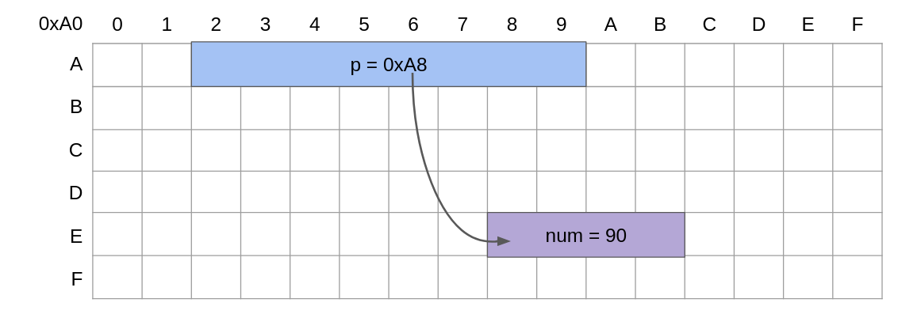
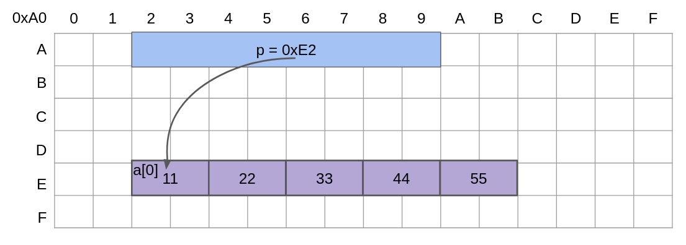
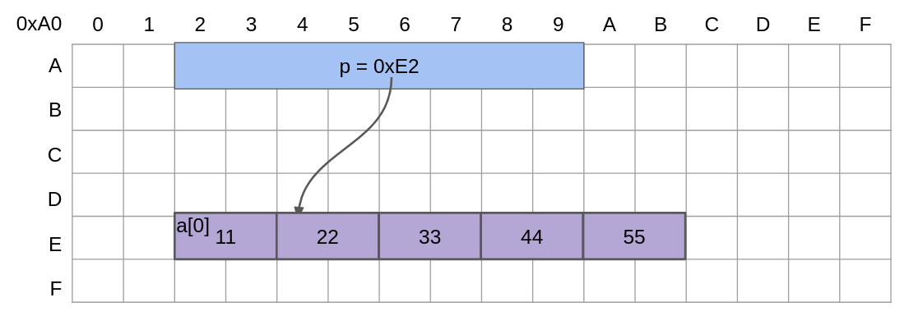
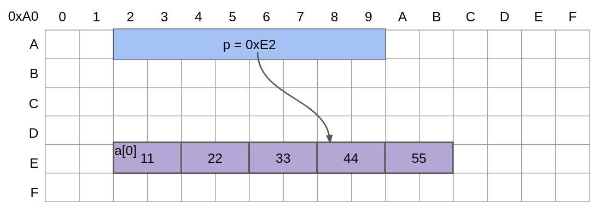
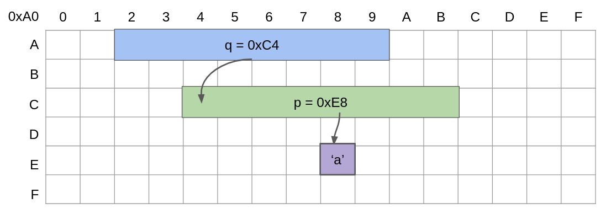
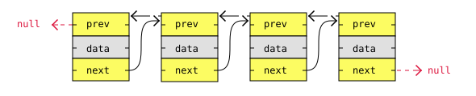
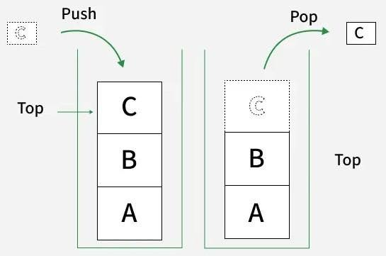
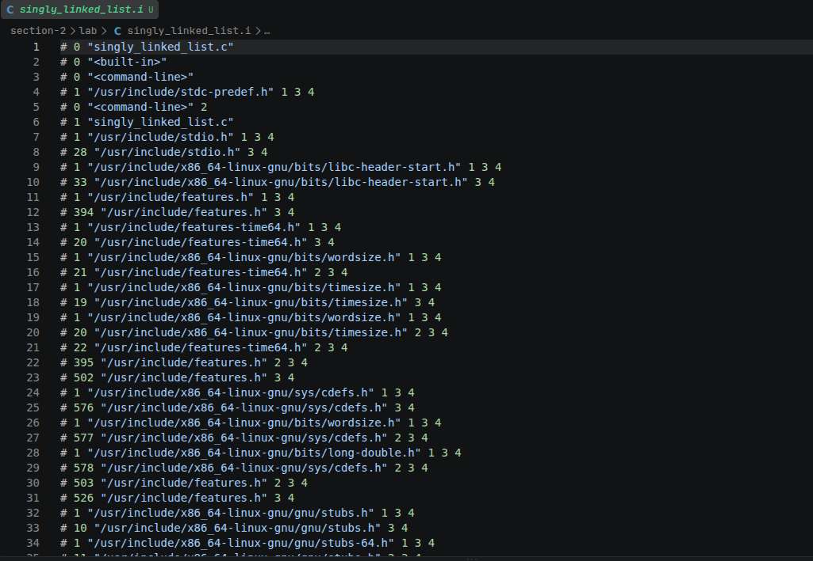
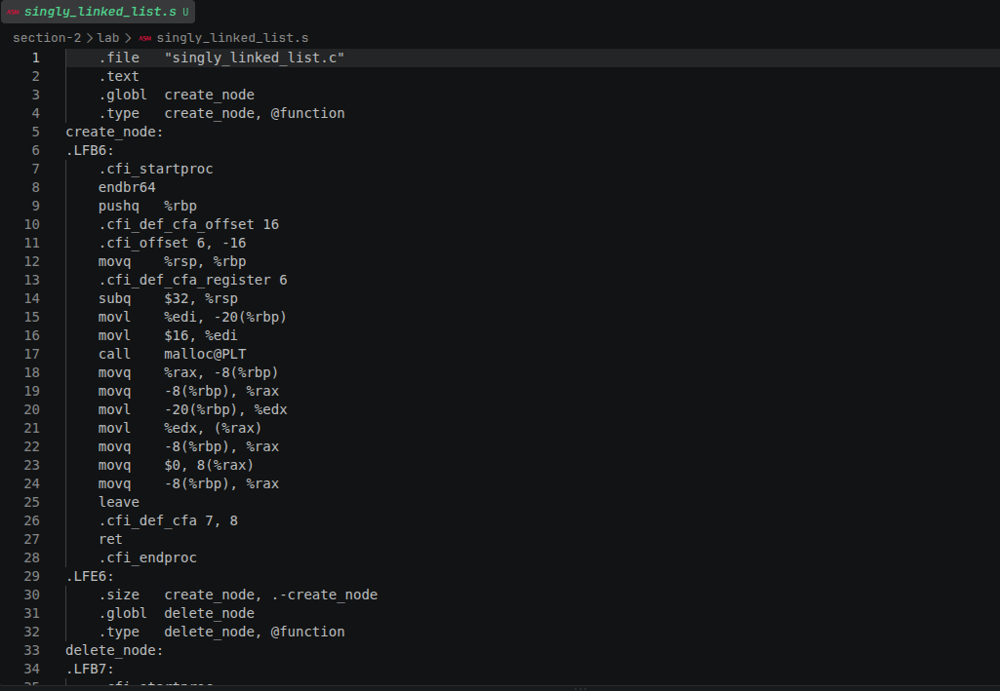
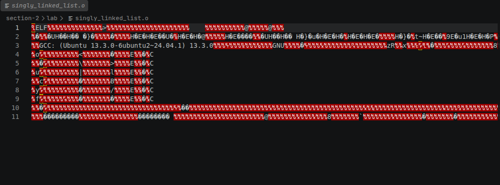

# Section 2

- **Section**: Linux System Programming
- **Topic**: C Programming Language Review
- **Duration**: 3 working days (8 hours/day) 

## Table of Contents

- [1. C Syntax Essentials](#1-c-syntax-essentials)
- [2. Pointers and arrays](#2-pointers-and-arrays)
- [3. Structs, unions, and typedefs](#3-structs-unions-and-typedefs)
- [4. Dynamic memory management](#4-dynamic-memory-management)
- [5. Compilation pipeline](#5-compilation-pipeline)
- [6. Basic data structures](#6-basic-data-structures)
- [7. Function pointers and callback-style APIs](#7-function-pointers-and-callback-style-apis)
- [8. Lab](#8-lab)

## 1. C Syntax Essentials

### 1.1. Variables

#### Syntax

``` C
// Declare
// type variableName;
// type variableName = value;

int age = 10; 
char ch = 'a';
float temperature;

// Assign 
// variableName = value;

age = 99;
temperature = 20.04;
```

#### Data types

|Type|Meaning|Size
|-|-|-|
|int|Integer|4 bytes|
|float|Decimal numbers|4 bytes|
|double|Decimal numbers, more precision than float|8 bytes|
|char|Single character|1 byte|
|bool|`true`/`false`|1 byte|

### 1.2. Control flow

#### Conditionals (`if-else`, `switch case`)
```C
if(gpa >= 3.6) 
    printf("Xuất sắc");
else if(gpa >= 3.2)
    printf("Giỏi");
else 
    printf("Fail CV!");
```
```C
switch (grade):
    case 'A':
        printf("Giỏi");
        break; 
    case 'B':
        printf("Khá");
        break;
    default:
        printf("Fail CV");
```

#### Loop (`for, while, do-while`):
```C
for (int i = 0; i < 5; i++) {
    printf("%d ", i); // 0 1 2 3 4 
}
```

```C
int count = 0;
while (count < 5) {
    count++;
}
```

```C
int x = 10;
do {
    x++;
} while (x < 5);
```

### 1.3. Functions

Function declaration:
```
return_type function_name(parametersType parameters);
```
```C
void hello(void);
int addNumbers(int a, int b);
```

Function definition:
```
return_type function_name(parametersType parameters) {
  // function body
}
```
```C
void hello(void)
{
    printf("Hello, world!\n");
}
int addNumbers(int a, int b) {
    return a + b;
}
```
Function call:
```
function_name(args);
```
```C
hello(); // Prints "Hello, world!"
int result = addNumbers(5, 3); 
printf("%d", result) // 8
```

- return_type: The data type of the value the function returns (`int`, `float`). `void` if the function does not return any value

---

## 2. Pointers and arrays

### 2.1. Pointers

Pointers are **variables** that store memory address of another variable.

Size of pointers are depended on the system architecture.
- 32-bit Systems uses 4 bytes pointers.
- 64-bit Systems uses 8 bytes pointers.

Example:

```C
int num = 90;
int *p = &num; // assuming 64-bit Systems, pointer p will take 8 bytes
```


### 2.2. Pointer manipulation

#### Basic manipulation

```C
int x = 10;
int *p = &x; 

printf("%d\n", *p);  // 10

*p = 20;             
printf("%d\n", x);   // 20
```
- `int *p`: initializes `p` as a int pointer (`int*` type)
- `&x`: gets the address of `x`
- `*p`: accesses the value of the memory that `p` is holding

#### Pointer arithmetic

Pointer arithmetic can move a pointer to a type to the next item of that type.
```C
// assuming 64-bit Systems
int16_t a[5] = {11, 22, 33, 44, 55};
int16_t *p = &a[0];
printf("%d\n", *p); // 11
```


```C
p++;
printf("%d\n", *p); // 22
```



```C
p += 2;
printf("%d\n", *p); // 44
```


### 2.3. Pointers to Pointers

Pointers to Pointers are when **pointers hold the addresses of other pointers**.

```C
char c = 'a';  // Type: char
char *p = &c;   // Type: pointer to a char
char **q = &p;  // Type: pointer to pointer to char

printf("%c %c\n", *p, **q);  // a a
```



```C
**q = 'b' // change the value of the variable c through a two-star pointer

printf("%c %c\n", *p, **q);  // b b
```

### 2.4. Arrays vs. pointers

An array and a pointer are different types:

- An array is an object consisting of a fixed number of elements of the same type stored contiguously in memory.
    ```c
    int arr[5] = {1, 2, 3, 4, 5}; // arr is a variable of type int[5]
    ```

- A pointer is a variable that holds an address of another variable.
    ```c
    int a = 999;
    int *q = &a; // q is a pointer variable of type int*
    ``` 
Some similarities and differences of an array and a pointer:

```c
int arr[5] = {1, 2, 3, 4, 5};
int *p = arr;
```
- Suppose the first element has the address of 0xA0
  ```c
  printf("%p", p); // 0xA0
  
  printf("%p", arr); // 0xA0
  
  printf("%p", &arr); // 0xA0
  
  printf("%p", &arr[0]); // 0xA0
  ```
  `arr` decays into a pointer to its first element `&arr[0]`
- Pointer arithmetic does works with `arr` variable:
  ```c
  printf("%p", p + 1); // 0xA4
  
  printf("%p", arr + 1); // 0xA4
  
  printf("%p", &arr[0] + 1); // 0xA4
  
  printf("%p", &arr + 1); // 0xB4 ??? 
  
  // &arr is in the type of int (*)[5] 
  // so &arr + 1 jumps 5*sizeof(int) = 20 bytes instead of only 4 bytes
  ```
- `sizeof(p)` - size of the pointer p, `sizeof(arr)` - size of the array (= 5 * sizeof(int))

### 2.5. String handling functions

Remember to include the `<string.h>` header file 

|Function|Description|
|-|-|
|`strlen(str)`|Returns the number of characters in the string, excluding the `\0`.|
|`strcpy(dest, src)	`|Copies contents of src string to dest.|
|`strncpy(dest, src, n)	`|Copies up to n characters from src to dest|
|`strcat(dest, src)`|Appends src string to the end of dest.|
|`strncat(dest, src, n)`|Appends up to n characters from src to dst.|
|`strcmp(str1, str2)`|Compares two strings and returns 0 if equal.|
|`strncmp(str1, str2, n)`|Compares up to n characters of two strings.|
|`strchr(str, ch)`|Finds the first occurrence of character ch in string.|
|`strrchr(str, ch)	`|Finds the last occurrence of character ch in string.|
|`strstr(str, substr)`|Finds the first occurrence of substring in string.|
|`strtok(str, delim)`|Splits string into tokens using delimiter.|
|`memset(ptr, val, n)`|Fills memory with a specified value.|
|`memcpy(dest, src, n)`|Copies n bytes from src to dest.|
|`memcmp(ptr1, ptr2, n)`|Compares n bytes of two memory blocks.|

---

## 3. Structs, unions, and typedefs

### 3.1. Structs
- A `struct` is a user-defined type that holds multiple pieces of data.
- To bundle multiple variables into a single object.

#### Syntax

Declare `struct car` type:
```C
struct car {
    char *name;
    float price;
    int speed;
};
```

Declare a variable of `struct car` type:
```C
struct car vinfast; 
```

Initialize the variable:
```C
vinfast.name = "VinFast VF3";
vinfast.price = 300.3;
vinfast.speed = 175;
```

Initializers:
```C
struct car vinfast = {"VinFast VF3", 300.3, 175};
```

#### Passing structs by value

The original struct won't be modified, but an independent copy will be created.
```C
void print_price(struct car c) {
  printf("%f", c.price); // 300.3
}
```

But this won't work if the data needed to be modified:
```C
void set_price(struct car c, float new_price) {
    c.price = new_price; 
}
```
```C
printf("%f", c.price); // 300.3

set_price(vinfast, 999);

printf("%f", c.price); // Still 300.3
```

#### Passing structs by pointer

Used for modifying the original struct or avoiding copying a large struct.
```C
void set_price(struct car *c, float new_price) {
    c->price = new_price; 
    // use '->' instead of '.' when accessing data from a struct pointer
}
```
```C
printf("%f", c.price); // 300.3

set_price(&vinfast, 999); // pass the struct address

printf("%f", c.price); // 999
```

### 3.2. Unions
- Basically just like structs, except the fields overlap in memory.
```C
union foo {
    int a, b, c, d, e, f;
    float g, h;
    char i, j, k, l;
};
```
- If this were a struct, it would took 36 bytes to hold it all. But it's a union, all those fields overlap in teh same strech of memory => only take 4 bytes.
- Downside: can only portably use one of those fields at a time 

### 3.3. Typedefs
Used for making new types as getting new names for existing types.

```C
typedef int antelope;  // Make "antelope" an alias for "int"

antelope x = 10;       // Type "antelope" is the same as type "int"
```

typedef and structs:
```C
struct animal {
    char *name;
    int leg_count, speed;
};

//  original name      new name
//            |         |
//            v         v
//      |-----------| |----|
typedef struct animal animal;

struct animal y;  // This works
animal z;         // This also works because "animal" is an alias
```

```C
//  original name
//            |
//            v
//      |-----------|
typedef struct animal {
    char *name;
    int leg_count, speed;
} animal;                         // <-- new name

struct animal y;  // This works
animal z;         // This also works because "animal" is an alias
```

```C
//  Anonymous struct! It has no name!
//         |
//         v
//      |----|
typedef struct {
    char *name;
    int leg_count, speed;
} animal;                         // <-- new name

//struct animal y;  // ERROR: this no longer works--no such struct!
animal z;           // This works because "animal" is an alias
```

---

## 4. Dynamic memory management

### 4.1. malloc()

- `malloc()` (memory allocation) is used to allocate a single block of contiguous memory on the heap at runtime.
- The allocated memory is **uninitialized**, meaning it contains garbage values.
- The function returns **a pointer to the allocated memory**. On failure, it returns `NULL`.

```C
int *arr = malloc(5 * sizeof(int));
if (x == NULL) {
  printf("Error allocating\n")
}
```

### 4.2. calloc()

- `calloc()` (contiguous allocation) allocates memory for multiple elements.
- It initializes the allocated memory to **zero**.
- The function returns **a pointer to the allocated memory**. On failure, it returns `NULL`.

```C
int *arr = calloc(5, sizeof(int));
if (x == NULL) {
  printf("Error allocating\n")
}
```

### 4.3. realloc()

- `realloc()` is used to resize a previously allocated memory block.
- The function returns **a pointer to the allocated memory**. On failure, it returns `NULL`.

```C
int *ptr = (int *)malloc(5 * sizeof(int));

// Reallocation
int *temp = (int *)realloc(ptr, 10 * sizeof(int));

// Only update the pointer if reallocation is successful
if (temp == NULL)
    printf("Memory Reallocation Failed\n");
else
    ptr = temp;
```


### 4.4. free()

- `free()` releases dynamically allocated memory by `malloc()` and `calloc()`

```C
int *ptr = (int *)calloc(5, sizeof(int));
    
for (int i = 0; i < 5; i++)
  printf("%d ", ptr[i]); 
    
// Free the memory after completing operations
free(ptr);
ptr = NULL; 
```

### 4.5. Common pitfalls 
#### Leaks
Occurs when dynamically allocated memory is not released properly.
```C
int *p = malloc(sizeof(int));

p = NULL; // We lost the memory address
        // => The memory can no longer be accessed or freed
```

#### Double-free
Occurs when a pointer got free twice.
```C
int *ptr = (int *)calloc(5, sizeof(int));
free(ptr); // OK
free(ptr); // Aborted (core dumped)
```

#### Dangling pointers
Free the memory without setting the pointer to NULL
```C
int *ptr = (int *)calloc(5, sizeof(int));
    
for (int i = 0; i < 5; i++)
  printf("%d ", ptr[i]); // 0 0 0 0 0 since we use calloc()
    
free(ptr); 
// no assigning NULL to ptr => ptr still holds the old address
// => Dangling pointers

for (int i = 0; i < 5; i++)
  printf("%d ", ptr[i]); // -1504568300 5 -1778696097 -377398520 0 
```

---

## 5. Compilation pipeline

`Source File -> Preprocessor -> Compiler -> Assembler -> Linker`

```
.c (Source File)
 ↓  preprocess
.i (Preprocessed File)
 ↓  compile
.s (Assembly code)
 ↓  assemble
.o (Object code)
 ↓  link
Executable File
```

```bash
gcc -E main.c -o main.i   # Preprocess

gcc -S main.i -o main.s   # Compile

gcc -c main.s -o main.o   # Assemble

gcc main.o -o main        # Link
```

### 5.1. Preprocessor

`gcc -E main.c -o main.i`

This phase includes:
1. ***Removal of Comments***

    `// This is a comment` and `/* This is also a comment */` 
    will get removed.

1. ***Expansion of Macros***

    ```C
    #define SIZE 10
    
    int arr[SIZE];
    ```
    turns into
    ```C
    int arr[10];
    ```

1. ***Expansion of the included files***

    
    ```C
    //myheader.h
    void foo(void);
    ```
    ```C
    //main.c
    #include "myheader.h"
    
    int main(void) {
        int arr[MAX_SIZE];
    }
    ```
    after preprocessing:
    ```C
    void foo(void);
    
    int main(void) {
        int arr[MAX_SIZE];
    }
    ```

1. ***Conditional compilation***

    Preprocessor decides which parts of the code will be kept based on **Directives** such as:

    ```C
    #ifdef
    #ifndef
    #if
    #elif
    #else
    #endif
    ```
    Example:
    ```C
    #define DEBUG
    
    #ifdef DEBUG
        printf("Debug mode\n");
    #else
        printf("Release mode\n");
    #endif
    ```
    turns into
    ```
    printf("Debug mode\n");
    ```

### 5.2. Compiler proper

`gcc -S main.i -o main.s`

The next step is to compile `main.i` and produce an intermediate compiled output file `main.s` (assembly-level instructions).

### 5.3. Assembler

`gcc -c main.s -o main.o`

In this phase, the `main.s` is taken as input and turned into `main.o` by the assembler. It translates assembly instructions into binary machine code.

### 5.4. Linker

`gcc main.o -o main`

In the final phase, linker combines multiple object files together and outputs the final executable file.

## 6. Basic data structures

### 6.1. Singly linked lists

A singly linked list is a dynamic linear data structure where each element, called a node, contains:

- `data`: the value stored in the node
- `next`: a pointer to the next node


### 6.2. Doubly linked lists

Same as singly linked lists, but nodes in doubly linked lists have references to their previous nodes. A node contains:

- `prev`: a pointer to the previous node
- `data`: the value stored in the node
- `next`: a pointer to the next node



### 6.3. Stack
- A stack is a linear data structure that follows the **LIFO** (Last In First Out) principle.
- Can be implemented using an array or a singly linked list.



- Basic operations:
  - `push()`: Add an element to the top.
  - `pop()`: Remove the top element.
  - `peek()`: View the top element without removing it.
  - `isEmpty()`: Check whether the stack is empty.


### 6.4. Queue
- A queue is a linear data structure that follows the **FIFO** (First In First Out) principle.
- Can be implemented using an array or a singly linked list.


- Basic operations:
  - `enqueue()`: Add an element to the rear.
  - `dequeue()`: Remove an element from the front.
  - `front()`: View the front element.
  - `isEmpty()`: Check whether the queue is empty.

## 7. Function pointers and callback-style APIs

### 7.1. Function pointers

- Pointers store memory addresses. While pointers are commonly used with variables, they can also store the address of a function.
- A function pointer is a pointer that stores the address of a function.
- Usage:
  - Calling functions indirectly
  - Passing functions as arguments
  - Implementing callbacks
  - Creating function tables

Example:

  - We have a simple add function:
    ```C
    int add(int a, int b)
    {
        return a + b;
    }
    ```
  - Declare a function pointer:
    ```C
    int (*func_ptr)(int, int);
    ```
  - Assign the address of the add function to func_ptr:
    ```C
    func_ptr = add;
    ```
  - Call the function through the function pointer:
    ```C
    // func_ptr(1, 2) is now equivalent to add(1, 2).
    printf("%d", func_ptr(1+2)); // Output: 3
    ```

### 7.2. Callback

A callback is the process of **passing a function to another function** as an argument so that the receiving function can call it later.

Example:
```C
#include <stdio.h>

int add(int a, int b) { return a + b; }
int subtract(int a, int b) { return a - b; }
int multiply(int a, int b) { return a * b; }
int divide(int a, int b) { return a / b; }

void calculator(int a, int b, int (*callback)(int, int))
{
    printf("%d\n", callback(a, b));
}

int main(void)
{
    int a = 10, b = 2;
    calculator(a, b, add);
    calculator(a, b, subtract);
    calculator(a, b, multiply);
    calculator(a, b, divide);
    return 0;
}
```
Output:
```
12
8
20
5
```

However writing a function pointer directly can become difficult to read:
```C
int (*callback)(int, int)
```

For callback-style APIs, we usually define a named callback type using typedef:
```C
typedef int (*OperationCallback)(int, int);
```

Now the API becomes easier to understand:
```C
void calculator(int a, int b, OperationCallback operation)
{
    printf("%d\n", operation(a, b));
}
```

## 8. Lab 

### Implement a singly linked list in C from scratch (insert/delete/traverse):

[Source code](./lab/singly_linked_list.c)

```C
int main()
{
    Node* head = NULL;
    insert_back(&head, 1);
    insert_back(&head, 2);
    insert_back(&head, 3);
    insert_back(&head, 4);
    insert_back(&head, 5);
    insert_front(&head, 1000);

    delete_node(&head, 3);
    traverse_node(head, print_node); 
    // Output: 1000 1 2 4 5
}
```
Result:
```bash
dungvd@dungvd-asus:~/zhone-engineering-academy-lab/section-2/lab$ gcc singly_linked_list.c -o singly_linked_list
dungvd@dungvd-asus:~/zhone-engineering-academy-lab/section-2/lab$ ./singly_linked_list 
1000
1
2
4
5
```

### Compile a small program through each gcc stage (-E, -S, -c, then full link) and inspect the output of each stage:

We do this experiment with the program above:

- Preprocess: `gcc -E singly_linked_list.c -o singly_linked_list.i`

    

- Compile: `gcc -S singly_linked_list.i -o singly_linked_list.s`

    

- Assembly: `gcc -c singly_linked_list.s -o singly_linked_list.o`

    

- Link: `gcc singly_linked_list.o -o singly_linked_list`
    
    `singly_linked_list.o` is compiled into an executable file `singly_linked_list`, which can be execute by running this command:
    ```bash
    <path_to_file>/singly_linked_list
    ```

### Write a small program that uses function pointers to implement a simple callback/dispatch table 

[Source code](./lab/dispatch_table.c)

```C
dungvd@dungvd-asus:~/zhone-engineering-academy-lab/section-2/lab$ gcc dispatch_table.c -o dispatch_table
dungvd@dungvd-asus:~/zhone-engineering-academy-lab/section-2/lab$ ./dispatch_table 
12
8
20
5
```