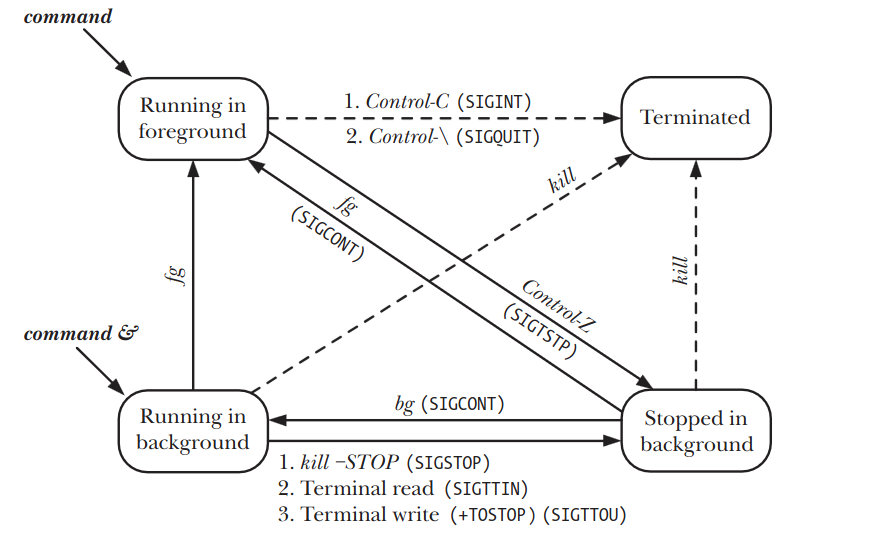
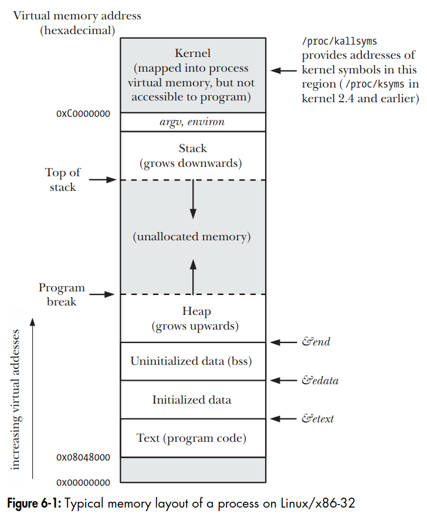
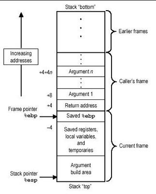
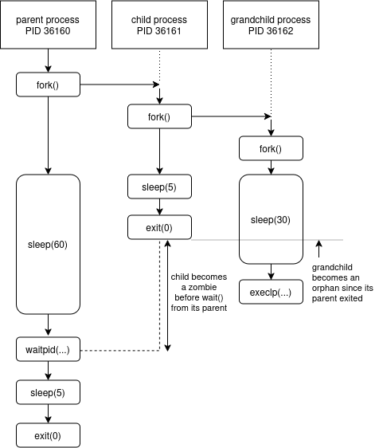

# Section 3

- **Section**: Linux System Programming
- **Topic**: Process Fundamentals, Memory Layout 
- **Duration**: 4 working days (8 hours/day) 

---

## Table of Contents

1. [Processes, Process Identifiers](#1-processes-process-identifiers)
1. [Process creation (fork/vfork)](#2-process-creation-forkvfork)

---
## 1. Processes, Process Identifiers

### 1.1. Processes and Programs
- A *process* is an instance of an executing program.
- A *program* is a file containing a range of information that describes how to construct a process at run time.
- Multiple processes can execute the same program.

or simply:

- A *program* is like a recipe.
- A *process* is like an actual cooking session using that recipe. Multiple chefs can cook multiple dishes with the same recipe.

### 1.2. Process ID
- Each process has a unique integer *process identifier* (PID).
- Each process also has a
*parent process identifier* (PPID) attribute, which identifies the process that requested
the kernel to create this process.
- Use `getpid()` to returns the process ID of the calling process.
- Use `getppid()` to returns the process ID of the parent of the calling process.

---
## 2. Process creation (fork/vfork) 

### 2.1. fork()

A process can create a new process using the `fork()` system call.

```c
#include <unistd.h>

pid_t fork(void);

/* In parent: returns process ID of child on success, or –1 on error; 
in successfully created child: always returns 0 */
```

```
process A
  │
fork()
  ├─ process A: parent process ─────────▶ 
  │
  └─ process B: child process  ─────────▶   
```
- The child obtains copies of the parent’s stack, data, heap, and text segments.

- Both processes continue running independently.

**Example 1:**
```c
int main(void) {
    printf("Before fork\n");
    fork();
    printf("Hello, World!\n");
}
```
Output:
```
Before fork
Hello, World!
Hello, World!
```
*There were 2 processes did the printf()*

**Example 2:**
```c
#include <stdio.h>
#include <sys/types.h>
#include <unistd.h>

int main(void)
{
    pid_t pid = fork();

    if (pid < 0) 
    {
        perror("fork failed");
        return 1;
    } 
    else if (pid == 0) 
    {
        printf("This is the child process with PID: %d and Parent PID: %d\n", getpid(), getppid());
    }
    else 
    {
        printf("This is the parent process with PID: %d and Child PID: %d\n", getpid(), pid);
    }

    return 0;
}
```
Output:
```
This is the parent process with PID: 22286 and Child PID: 22287
This is the child process with PID: 22287 and Parent PID: 2185
```

### 2.2. vfork()

`vfork()` is a version of `fork()`, operated with slightly different semantic.

```c
#include <unistd.h>

pid_t fork(void);

/* In parent: returns process ID of child on success, or –1 on error;
in successfully created child: always returns 0 */
```

```
process A
  │
vfork()
  ├─ process A: parent process (suspended)
  │
  └─ process B: child process ─────────▶             
```

- No duplication of virtual memory pages or page tables is done for the child process. Instead, the child shares the parent’s memory.
- Execution of the parent process is suspended until the child has performed an
`exec()` or `_exit()`.

**Example:**
```c
#include <stdio.h>
#include <sys/types.h>
#include <unistd.h>

int main(void)
{
    printf("Before vfork\n");

    pid_t pid = vfork();

    if (pid == 0) 
    {
        printf("Child process\n");
        _exit(0);
    }

    printf("Parent process\n");

    return 0;
}
```
Output:
```
Before vfork
Child process
Parent process
```

---
## 3. Process Termination (_exit/exit)

**Two ways of process termination**:

- *Abnormal termination*: caused by the delivery of a signal whose default action is to terminate the process.
- *Normal termination*: using the `_exit()` system call.

**Termination status**:
- only the bottom 8 bits of status are actually made available to the parent.
- `EXIT_SUCCESS` (0) and `EXIT_FAILURE` (1).
    ```c
    _exit(EXIT_SUCCESS);
    ```

### 3.1. _exit()
```c
#include <unistd.h>

void _exit(int status);
```
`_exit()` is a system call that terminates the calling process immediately


### 3.2. exit()
```c
#include <stdlib.h>

void exit(int status);
```
`exit()` is a C library function layered on top of `_exit()`.

The following actions are performed by `exit()`:
1. Exit handlers (functions registered with `atexit()` and `on_exit()`) are called, in reverse order of their registration.
1. Flush `stdio` stream buffers.
1. Invoke `_exit()` system call.


### 3.3. Return from main()
```c
int main()
{
    return 0;
}
```
The `main()` function returns first. As the function returns, its stack frame disappears, meaning ***all local variables declared within `main()` are immediately destroyed.*** After that, the C runtime startup code calls `exit()`.

**To differentiate a "Return from `main()`" from an "`exit()` inside main", let's run an experiment:**

```c
#include <stdio.h>
#include <stdlib.h>

char **g_key_ptr = NULL; /* A global pointer to char* */

/* Function that prints the value pointed to by the global pointer */
void key_backup(void) 
{
    if (g_key_ptr) {
        printf("Program shutting down...\n");
        printf("Please backup this code: %s\n", *g_key_ptr);
    }
}

int main(void)
{
    char* super_important_key = "sixseven"; /* Main local variable */
    g_key_ptr = &super_important_key; /* The global pointer to the local variable */

    atexit(key_backup); /* Register key_backup as an exit handler */

    return 0; /* Let's try returning from main() */
}
```
Output:
```
Program shutting down...
Please backup this code: @�,��
```
> Some weird characters appeared!

Explanation the `return 0;` workflow:

1. The `main()` function returns. The local variable `super_important_key` stored in `main()` stack frame disappears.
1. `g_key_ptr` becomes a dangling pointer since it points to a freed address.
1. `exit()` automatically occurs after `main()` returns.
1. `exit()` called registerd exit handlers, which is `key_backup` in this case.
1. The `key_backup` function performs a printf from `g_key_ptr`, resulting in undefined behaviors.

**Let's make a simple change:**
```c
#include <stdio.h>
#include <stdlib.h>

char **g_key_ptr = NULL;

void key_backup(void)
{
    if (g_key_ptr) {
        printf("Program shutting down...\n");
        printf("Please backup this code: %s\n", *g_key_ptr);
    }
}

int main(void)
{
    char* super_important_key = "sixseven";
    g_key_ptr = &super_important_key; 

    atexit(key_backup);

    /* return 0; */
    exit(0); /* Use exit() instead */
}
```
Output
```
Program shutting down...
Please backup this code: sixseven
```
> Works properly!

Now, the exit handler can access data from `main()` local variables with ease because calling `exit(0)` directly inside `main()` triggers the handler before the `main()` stack frame is destroyed.


---
## 4. Monitoring Child Processes (wait/waitpid/waitid)

### 4.1. wait()

The `wait()` system call waits for one of the children of the calling process to terminate.

```c
#include <sys/wait.h>

pid_t wait(int *status); 
/* Returns process ID of terminated child, or –1 on error */
```

The `wait()` system call does the following:
1. `wait()` blocks until one of the children terminates.
If a child has already terminated by the time of the call, `wait()` returns immediately.
1. `status` is an output parameter, `wait()` writes information about how the child terminated.  
1. The kernel adds the process CPU times and resource usage statistics to running totals for all children of this parent process.
1. `wait()` returns the PID of the child that has terminated.

```
parent
  │
fork()
  ├─ parent ────────|wait() blocks |───────▶
  │                                │
  └─ child  ────────────────exit()─┘   
```

### 4.2. waitpid()

`wait()` waits for any one of the children, while `waitpid()` waits for a specific one by specifying its process ID or its stopped signal.

```c
#include <sys/wait.h>

pid_t waitpid(pid_t pid, int *status, int options);

/* Returns process ID of child, 0 (WNOHANG if no child has changed state), or –1 (error) */
```
The return value and `status` arguments of `waitpid()` are the same as for `wait()`.

```
parent
  │
fork()
  ├─ parent ────|wait(123, NULL, 0) blocks |───────▶
  │                                        │
  ├─ child (PID 123) ───────────────exit()─┘   
  │                                
  └─ child (PID 139) ──────────────────────────────▶
```


|`pid` arguments|Description|
|-|-|
|> 0|Wait for the child whose process ID == `pid`.|
|= 0|Wait for any child in the same *process group* as the caller (parent).|
|< -1|Wait for any child whose *process group* identifier equals the absolute value of `pid`.|
|= -1|Wait for any child. `wait(&status)` is equivalent to `waitpid(–1, &status, 0)`.|

If no children that match the specification in `pid`, `waitpid()` fails with the error `ECHILD`.

|`options` arguments|Description|
|-|-|
|`WUNTRACED`|Wait for children that have been stopped by a signal.|
|`WCONTINUED`|Wait for children that have been resumed by a SIGCONT signal.|
|`WNOHANG`|If no child has yet changed state, then return `0` immediately, instead of blocking.

### 4.3. waitid()
`waitid()` is like `waitpid()` but provides extra functionality.

```c
#include <sys/wait.h>

int waitid(idtype_t idtype, id_t id, siginfo_t *infop, int options);

/* Returns 0 on success or if WNOHANG was specified and
there were no children to wait for, or –1 on error */
```

|`idtype` arguments|Description|
|-|-|
|`P_ALL`|Wait for any child; `id` is ignored|
|`P_PID`|Wait for the child whose *process ID* equals `id`|
|`P_PGID`|Wait for any child whose *process group ID* equals `id`|

|`options` arguments|Description|
|-|-|
|`WEXITED`|Wait for children that have terminated, either normally or abnormally.|
|`WSTOPPED`|Wait for children that have been stopped by a signal.|
|`WCONTINUED`|Wait for children that have been resumed by a `SIGCONT` signal.|
|`WNOHANG`|If no child has yet changed state, then return `0` immediately, instead of blocking.|
|`WNOWAIT`|The child status is returned, but the child remains in a waitable state, and we can later wait for it again to retrieve the same information|

|`siginfo_t` struct|Description|
|-|-|
|`si_code`|This field contains one of the following values:<br>- `CLD_EXITED`, indicating that the child terminated by calling `_exit()`; <br>- `CLD_KILLED`, indicating that the child was killed by a signal. <br>- `CLD_STOPPED`, indicating that the child was stopped by a signal; <br>- `CLD_CONTINUED`, indicating that the (previously stopped) child resumed execution as a consequence of receiving a (`SIGCONT`) signal.|
|`si_signo`|This field is always set to `SIGCHLD`.|
|`si_status`|This field is always set to `SIGCHLD`.|
|`si_uid`|This field contains the real user ID of the child. Most other UNIX implementations don’t set this field.|

### 4.4. Orphans and Zombies

#### Orphans
- Child processes that lost their parents (parent processes got terminated, while the children didn't). 
- The orphans are adopted by `init` process, the ancestor of all processes, whose PID is 1.


#### Zombies
-  A zombie is a child process that already exited, but whose parent hasn't called `wait()` yet to collect the result.

---
## 5. Program Execution (exec)

`execve()` system call loads a new program into a process’s memory.

During this operation, the old program is discarded, and the process’s stack, data, and heap are replaced by those of the new program.

`exec()` library functions are layered on top of `execve()`, provide alternative APIs.

```c
#include <unistd.h>

int execve(const char *pathname, char *const argv[], char *const envp[]);
int execle(const char *pathname, const char *arg, ...
/* , (char *) NULL, char *const envp[] */ );
int execlp(const char *filename, const char *arg, ...
/* , (char *) NULL */);
int execvp(const char *filename, char *const argv[]);
int execv(const char *pathname, char *const argv[]);
int execl(const char *pathname, const char *arg, ...
/* , (char *) NULL */);

/* None of the above returns on success; all return –1 on error */
```

|Function|Specification of program file <br> *(–, p)*|Specification of arguments <br> *(v, l)*|Source of environment <br> *(e, –)*|
|-|-|-|-|
|`execve()`| pathname| array| *envp* argument
|`execle()`| pathname| list| *envp* argument
|`execlp()`| filename + PATH|  list| caller’s *environ*
|`execvp()`| filename + PATH|  array| caller’s *environ*
|`execv()`| pathname| array| caller’s *environ*
|`execl()`| pathname| list| caller’s *environ*

**Specification of program file (–, p)**

- `-`: You provide the pathname yourself
  ```c
  execl("/bin/echo", "echo", "Hello", NULL);
  ```

- `p`: Search for the program using $PATH
  ```c
  execlp("echo", "echo", "Hello", NULL);
  ```

**Specification of arguments (v, l)**

- `v`: vector/array
  ```c
  char *args[] = {"ls", "-la", "~", NULL};
  execvp("ls", args);
  ```

- `l`: list
  ```c
  execlp("ls", "ls", "-la", "~", NULL);
  ```

**Source of environment (e, –)**

- `-`: Inherit the caller's environment <br>
  For example, if the current process has:
  ```c
  PATH=/usr/bin:/bin
  HOME=/home/user
  USER=dungvd
  ```
  the new program receives those environment variables.

- `e`: Explicitly provide a new environment
  ```c
  char *envp[] = {
      "MY_NAME=Dung Vu",
      "LANG=C",
      NULL
  };

  execve("/usr/bin/env", argv, envp);
  ```


---
## 6. Race Conditions between fork/exec/wait

After `fork()`, parent and child run independently.

We *cannot assume which process runs first* since different UNIX systems and Linux kernel versions may schedule differently:
- Some versions tend to run the parent first. (Linux 2.2.19, Linux 2.6.32)
- Others tend to run the child first. (adopted in Linux 2.6)

To guarantee a particular order, we must use some kind of synchronization technique, such as semaphores, file locks, IPC, signals. 

---
## 7. system Function
`system()`: allows the calling program to execute an arbitrary shell command

```c
#include <stdlib.h>

int system(const char *command);
```
Examples:
```c
system("clear");
system("echo Hello!");
system("ls *.c > files.txt");
```

`system()` function ***creates a child process*** that invokes a shell to execute command.

**Advantages of `system()`:**

- We don’t need to handle the details of calling `fork()`, `exec()`, `wait()`, and `exit()`, or handle errors and signal.
- `system()` uses the shell to execute command => All of the *shell processing, substitutions, redirections* are performed on command before it is executed.

**Disadvantage of `system()`:**

- Ineffciency. Executing a command using `system()`
requires the creation of at least 2 processes:
  - one for the shell,
  - one or more for the command(s) its execute.

**Return value of `system()`:**

- If `command` is a `NULL` pointer:
  - returns a non zero value if a shell is available,
  - returns `0` if no shell is available.
- If a child process couldn't be created / its termination couldn't be retrieved:
  - returns `-1`.
- If a shell could not be execed in the child process:
  - returns a value as though the child shell had terminated with the call `_exit(127)`.
- If all system calls succeed:
  - returns the termination status of the child shell used to execute `command`.

---
## 8. Process Groups, Sessions, Controlling Terminal & Job Control

```
Terminal session
       │
       ▼
    Session
       │
       ├── Job 1 → Process Group
       │             ├── process
       │             └── process
       │
       ├── Job 2 → Process Group
       │             └── process
       │
       └── Job 3 → Process Group
                     ├── process
                     └── process
```

### 8.1. Process Groups

A *process group* is a collection of related processes.

Identified by a *process group identifier* (PGID).

**Process group leader**:
- The process that creates the group.
- Whose PID become PGID of the group.

**Process group lifetime**:
- Begins when the leader creates the group.
- Ends when the last member leaves the group (by terminating or joining another process group).
- The process group leader need not be the last member of a process group.

***Foreground process group*** is for the terminal, the others are ***Background process groups***.

```c
#include <unistd.h>

pid_t getpgrp(void);

/* Always successfully returns process group ID of calling process */
```

```c
#include <unistd.h>

int setpgid(pid_t pid, pid_t pgid);

/* Returns 0 on success, or –1 on error */
/* If pid and pgid match, the specified process becomes the leader of a new process group. */
```

### 8.2. Sessions
A *session* is a collection of process groups. 

Identified by a *session identifier* (SID).

**Session leader**:
- The process that creates a new session.
- Whose process ID becomes the session ID
- A new process inherits its parent’s session ID

```c
#define _XOPEN_SOURCE 500
#include <unistd.h>

pid_t getsid(pid_t pid);

/* Returns session ID of specified process, or (pid_t) –1 on error */
```

```c
#include <unistd.h>

pid_t setsid(void);

/* Returns session ID of new session, or (pid_t) –1 on error */
```

### 8.3. Controlling Terminal

A *controlling terminal* is a terminal device associated with a session that manages terminal-based processes and handles job control, signals, and session lifetimes.

A terminal may be the controlling terminal for at most one session.

Obtaining a pathname that refers to the controlling terminal:
```c
#include <stdio.h> /* Defines L_ctermid constant */

char *ctermid(char *ttyname);

/* Returns pointer to string containing pathname of controlling terminal,
or NULL if pathname could not be determined */
```

### 8.4. Job Control

*Job control* a shell feature.

Job control permits user to simultaneously execute multiple commands (jobs), one in the foreground and the others in the background.

Jobs can be stopped and resumed, and moved between the foreground and background.

#### Using Job Control Within the Shell

When using `&` at the end of a command, it's run as a background job.

Creating background jobs:
```bash
$ sleep 60 & 
[1] 37546   # Job 1 with PID 37546
$ sleep 100 &
[2] 37621   # Job 2 with PID 37621
```

List all background jobs:
```bash
& jobs
[1]-  Running         sleep 60 &
[2]+  Running         sleep 100 &
```

Move a background job to the foreground:
```bash
$ fg %1
sleep 60
```

Suspend a job (`Control-Z`-`SIGTSTP` signal):
```bash
^Z
[1]+  Stopped                 sleep 60
```

Resume a job in the foreground (`fg`) or in the background (`bg`):
```bash
$ bg %1
[1]+ sleep 60 &
```



---
## 9. Command-Line Arguments and Environment List

### 9.1. Command-Line Arguments

When the program is executed, the command-line arguments (the separate words parsed by the shell) are made available via two arguments to the function `main()`.

```c
int main(int argc, char *argv[])
{
  // ...
}
```
- `int argc`: how many command-line arguments there are.
- `char *argv[]`: an array of pointers to the command-line arguments.
  
Examples:

```c
/* program.c */
#include <stdio.h>

int main(int argc, char *argv[])
{
    printf("argument count: %d\n", argc);
    for (int i = 0; i < argc; i++) 
    {
        printf("argv[%d]: %s\n", i, argv[i]);
    }
    return 0;
}
```
```bash
$ ./program Hello World !
argument count: 4
argv[0]: ./program
argv[1]: Hello
argv[2]: World
argv[3]: !
```

### 9.2. Environment List

The **environment list** (or simply **environment**) is an array of strings in a process's user-space memory consisting of `name=value` pairs known as environment variables.

A new process inherits a copy of its parent's env => Environment changes from either process are not seen by the other process.

Adding a value to the environment using `export` command in `bash` shell:

```bash
$ export MY_PATH=~/Documents
$ echo $MY_PATH
/home/dungvd/Documents
```

#### Accessing the environment from a program

1. Using the global variable `char **environ`:

Example:
```c
#include <stdio.h>

extern char **environ;

int main(int argc, char *argv[])
{
    char **ep;

    for (ep = environ; *ep != NULL; ep++) 
    {
        puts(*ep);
    }
    return 0;
}
```
Output:
```
LINENO=19
SHELL=/bin/bash
SESSION_MANAGER=local/dungvd-asus:@/tmp/.ICE-unix/2453,unix/dungvd-asus:/tmp/.ICE-unix/2453
QT_ACCESSIBILITY=1
COLORTERM=truecolor
...
```

2. Declaring a third argument `char *envp[]` to `main()`:
  ```c
  int main(int argc, char *argv[], char *envp[])
  ```
- This argument can then be treated in the same way as `environ`, with the difference that its scope is local to main().

3. Using `getenv()` function:
```c
#include <stdlib.h>

char *getenv(const char *name);

/* Returns pointer to (value) string, or NULL if no such variable */
```

#### Modifying the environment from a program

1. `putenv()` function:
```c
#include <stdlib.h>

int putenv(char *string);

/* Returns 0 on success, or nonzero on error */
```
- `string` arg: a pointer to a strign of the form `name=value`
- After the `putenv()` call, this string is part of the environment => Modifying the bytes pointed by `string` will affect the process environment.

Example:
```c
#include <stdio.h>
#include <stdlib.h>

int main(int argc, char *argv[])
{
    printf("MY_VAR: %s\n", getenv("MY_VAR"));
    putenv("MY_VAR=my_value");
    printf("MY_VAR: %s\n", getenv("MY_VAR"));
    return 0;
}
```
Output:
```
MY_VAR: (null)
MY_VAR: my_value
```

2. `setenv()` function:
```c
#include <stdlib.h>

int setenv(const char *name, const char *value, int overwrite);

/* Returns 0 on success, or –1 on error */
```
- `name`: name of the new environment variable
- `value`: value of the new environment variable
- `overvalue`: 
  - `0`: doesn't change the env if the variable with `name` already exists
  - nonzero: always change the env.
- `setenv()` copies its arguments => we can subsequently modify the contents of the strings pointed to by `name` and `value` without affecting the environment.

3. `unsetenv()` function:
```c
#include <stdlib.h>

int unsetenv(const char *name);

/* Returns 0 on success, or –1 on error */
```
- `unsetenv()`removes the variable identified by name from the environment.

4. Erasing the entire environment:

By assigning `NULL` to `environ`
```c
environ = NULL;
```
or using `clearenv()` function
```c
#define _BSD_SOURCE /* Or: #define _SVID_SOURCE */
#include <stdlib.h>

int clearenv(void)

/* Returns 0 on success, or –1 on error */
```
---
## 10. Memory Layout of a C Program (text/data/bss/heap/stack)



|Segment|Description|
|-|-|
|Text|- Program instructions/code <br>- Read-only|
|Data|- Initialized global/static variables|
|BSS|- Uninitialized global/static variables|
|Heap|- is an area for dynamic allocation at run time. <br>- `malloc()`, `calloc()`, `realloc()`|
|Stack|- is a dynamically growing and shrinking segment containing stack frame. <br>- One stack frame is allocated for each currently called function. <br> - function's local variables, arguments, and return value|

```c
#include <stdio.h>
#include <stdlib.h>
char globBuf[65536]; /* Uninitialized data segment */
int primes[] = { 2, 3, 5, 7 }; /* Initialized data segment */

static int square(int x) /* Allocated in frame for square() */
{
  int result; /* Allocated in frame for square() */

  result = x * x;
  return result; /* Return value passed via register */
}

static void doCalc(int val) /* Allocated in frame for doCalc() */
{
  printf("The square of %d is %d\n", val, square(val));

  if (val < 1000) {
    int t; /* Allocated in frame for doCalc() */

    t = val * val * val;
    printf("The cube of %d is %d\n", val, t);
  }
}
int main(int argc, char *argv[]) /* Allocated in frame for main() */
{
  static int key = 9973; /* Initialized data segment */
  static char mbuf[10240000]; /* Uninitialized data segment */
  char *p; /* Allocated in frame for main() */

  p = malloc(1024); /* Points to memory in heap segment */

  doCalc(key);
  exit(EXIT_SUCCESS);
}
```
---
## 11. Shared Libraries: static vs. dynamic linking

> **section 41**

Shared libraries are a technique for placing library functions into a single unit that can be shared by multiple processes at run time.

This technique can save both disk space and RAM.

---
## 12. getrlimit and setrlimit Functions (resource limits)

To get and set resource limits for a process, we use `getrlimit()` and `setrlimit()`.

```c
#include <sys/resource.h>

int getrlimit(int resource, struct rlimit *rlim);
int setrlimit(int resource, const struct rlimit *rlim);

/* Both return 0 on success, or –1 on error */
```
```c
struct rlimit {
  rlim_t rlim_cur; /* Soft limit (actual process limit) */
  rlim_t rlim_max; /* Hard limit (ceiling for rlim_cur) */
};
```

| resource | Limit on | SUSv3 |
|---|---|:---:|
| `RLIMIT_AS` | Process virtual memory size (bytes) | • |
| `RLIMIT_CORE` | Core file size (bytes) | • |
| `RLIMIT_CPU` | CPU time (seconds) | • |
| `RLIMIT_DATA` | Process data segment (bytes) | • |
| `RLIMIT_FSIZE` | File size (bytes) | • |
| `RLIMIT_MEMLOCK` | Locked memory (bytes) | |
| `RLIMIT_MSGQUEUE` | Bytes allocated for POSIX message queues for real user ID (since Linux 2.6.8) | |
| `RLIMIT_NICE` | Nice value (since Linux 2.6.12) | |
| `RLIMIT_NOFILE` | Maximum file descriptor number plus one | • |
| `RLIMIT_NPROC` | Number of processes for real user ID | |
| `RLIMIT_RSS` | Resident set size (bytes; not implemented) | |
| `RLIMIT_RTPRIO` | Realtime scheduling priority (since Linux 2.6.12) | |
| `RLIMIT_RTTIME` | Realtime CPU time (microseconds; since Linux 2.6.25) | |
| `RLIMIT_SIGPENDING` | Number of queued signals for real user ID (since Linux 2.6.8) | |
| `RLIMIT_STACK` | Size of stack segment (bytes) | • |

## 13. ELF format, symbol table, relocation - supplementary linking concepts

### 13.1. ELF format

Executable and Linkable Format (ELF), is the default binary format on Linux-based systems.


Each ELF file is made up of:
- **ELF header**: defines info about the ELF file
- File data:
  - **Program header table**: describes zero or more memory segments.
  - **Section header table**: describes zero or more sections.
  - Data referred to by entries in the **program header table** or **section header table**


### 13.2. Symbol table

[Reference](https://refspecs.linuxbase.org/elf/gabi4+/ch4.symtab.html)

`.symtab`

Symbol: variables, functions, labels, types, etc.

Symbol table: holds information needed to locate and relocate a program's symbolic definitions and references.

```c
typedef struct {
	Elf32_Word	st_name;
	Elf32_Addr	st_value;
	Elf32_Word	st_size;
	unsigned char	st_info;
	unsigned char	st_other;
	Elf32_Half	st_shndx;
} Elf32_Sym;
```
```c
typedef struct {
	Elf64_Word	st_name;
	unsigned char	st_info;
	unsigned char	st_other;
	Elf64_Half	st_shndx;
	Elf64_Addr	st_value;
	Elf64_Xword	st_size;
} Elf64_Sym;
```

- `st_name`: 
  - holds an index into the object file's **symbol string table** (`.strtab` - a storage for all symbo names)
  - holds the character representations of the symbol names.
- `st_value`:
  - This member gives the value of the associated symbol.
  - Before linking (in a `.o` file): holds an offset from the beginning of the section that the symbol is defined in (section index defined in `st_shndx`)
  - After linking (in the final `.elf`): holds the actual virtual address where the symbol resides 
- `st_size`:
  - Holds associated size of the symbol.
  - Holds 0 if the symbol has no size or an unknown size
- `st_info`:
  - Specifies the symbol's type and binding attributes
    - Binding: local, global, weak
    - Type: object, function, section, file

- `st_other`:
  - Visibility of the symbol: `STV_DEFAULT`, `STV_INTERNAL`, `STV_HIDDEN`, `STV_PROTECTED`

- `st_shndx`:
  - holds an index into the section header table.
  - tells which section this sysbol lives in.

### 13.3. Relocation

[Reference](https://refspecs.linuxbase.org/elf/gabi4+/ch4.reloc.html)

Relocation is the process of connecting symbolic references with symbolic definitions.

```c
typedef struct {
	Elf32_Addr	r_offset;
	Elf32_Word	r_info;
} Elf32_Rel;

typedef struct {
	Elf32_Addr	r_offset;
	Elf32_Word	r_info;
	Elf32_Sword	r_addend;
} Elf32_Rela;
```

```c
typedef struct {
	Elf64_Addr	r_offset;
	Elf64_Xword	r_info;
} Elf64_Rel;

typedef struct {
	Elf64_Addr	r_offset;
	Elf64_Xword	r_info;
	Elf64_Sxword	r_addend;
} Elf64_Rela;
```

---
## 14. Stack frame layout (System V AMD64 ABI): prologue/epilogue, %rbp/%rsp, register- vs. stack-passed arguments, the 128-byte red zone

## 14.1. Stack frame layout



## 14.2. Prologue/Epilogue
Prologue

```asm
push %rbp           ; save caller's base pointer
mov  %rsp, %rbp     ; set up new base pointer = current top of stack
sub  $32, %rsp      ; allocate space for local variables (if any)
```

Epilogue
```asm
mov  %rbp, %rsp     ; deallocate locals — rsp jumps back up to where rbp is
pop  %rbp           ; restore caller's base pointer
ret                 ; pop return address, jump back to caller
```

## 14.3. %rbp/%rsp

`%rbp`:
- The 64-bit base pointer
- Tracks the start of a stack frame. When a function is called, `%rbp` is set at the very start of that function.

`%rsp`:
- The 64-bit stack pointer
- Tracks the top of the stack (The lowest memory address boundary)

## 14.4. register- vs. stack-passed arguments

- In System V AMD64 ABI, there are 6 registers used to pass arguments: `rdi`, `rsi`, `rdx`, `rcx`, `r8`, `r9`.

- In function calls with more 6 arguments needed, the extra arguments got passed into the stack instead.

## 14.5. The 128-byte red zone

The System V AMD64 ABI reserves a 128-byte region beyond the current value of the stack pointer (`%rsp - 1` down to `%rsp - 128`) designated as the red zone.

Utilized for optimizing leaf functions - functions that does not call any other functions.

---
## 15. Reading compiler-generated Assembly (gcc -S / objdump -d) to identify a function's own stack frame

> The topic of inspecting compiler-generated Assembly (using gcc -S or objdump -d) to examine a function's stack frame is briefly mentioned in Section 6.8: "Performing a Nonlocal Goto: setjmp() and longjmp()" (specifically in the callout/note on page 136).  It appears under the section discussing how compiler optimizations affect local variables during a longjmp(), where the text notes:  "It is instructive to look at the assembler output produced when compiling the setjmp_vars.c program both with and without optimization. The cc -S command produces a file with the extension .s containing the generated assembler code for a program."  

## 16. Lab 

### Lab 1
Write a program using fork/exec/wait/waitpid; observe zombie and orphan processes 

[Lab 1 link](./lab/lab_1.c)

**Diagram**:



**Observation**:

At first, the parent process `fork()` to create a child process, then the child `fork()` to create a grandchild.

```bash
$ ./lab_1
[Parent process] PID: 36160, PPID: 7611, Time: 0
[Child process] PID: 36161, PPID: 36160, Time: 0
[Grandchild] PID: 36162, PPID: 36161, Time: 0
...
```

```bash
$ ps aux | grep lab_1
dungvd     36160  0.0  0.0   2692  1732 pts/1    S+   10:13   0:00 ./lab_1
dungvd     36161  0.0  0.0   2692  1000 pts/1    S+   10:13   0:00 ./lab_1
dungvd     36162  0.0  0.0   2692  1000 pts/1    S+   10:13   0:00 ./lab_1
```

After 5 seconds, the child exited then became a zombie. Since its parent (`PID 36160`) hadn't waited for it yet. The grandchild became an orphan because its parent (`PID 36161`) exited, then got adopted by the *user systemd* (`PID 2217`):
```
...
[Grandchild] PID: 36162, PPID: 36161, Time: 6
Child process - PID 36161 exiting
[Parent process] PID: 36160, PPID: 7611, Time: 8
[Grandchild] PID: 36162, PPID: 2217, Time: 8
...
```

```bash
$ ps aux | grep lab_1
dungvd     36160  0.0  0.0   2692  1732 pts/1    S+   10:13   0:00 ./lab_1
dungvd     36161  0.0  0.0      0     0 pts/1    Z+   10:13   0:00 [lab_1] <defunct>
dungvd     36162  0.0  0.0   2692  1000 pts/1    S+   10:13   0:00 ./lab_1

$ ps aux | grep 2217
dungvd      2217  0.0  0.1  21332  9876 ?        Ss   08:22   0:00 /usr/lib/systemd/systemd --user
```

After sleep for 30 seconds, the grandchild did a `execlp()` to run `echo` command then exited. The *user systemd* handled the grandchild exit:

```
...
Bye!!! Grandchild process using execlp to echo
[Parent process] PID: 36160, PPID: 7611, Time: 32
[Parent process] PID: 36160, PPID: 7611, Time: 34
[Parent process] PID: 36160, PPID: 7611, Time: 36
...
```
```bash
$ ps aux | grep lab_1
dungvd     36160  0.0  0.0   2692  1732 pts/1    S+   10:13   0:00 ./lab_1
dungvd     36161  0.0  0.0      0     0 pts/1    Z+   10:13   0:00 [lab_1] <defunct>
```

After that, the parent waited for the child. The child was no longer a zombie:
```
...
[Parent process] PID: 36160, PPID: 7611, Time: 58
parent waited!
[Parent process] PID: 36160, PPID: 7611, Time: 0
[Parent process] PID: 36160, PPID: 7611, Time: 2
...
```

```bash
$ ps aux | grep lab_1
dungvd     36160  0.0  0.0   2692  1732 pts/1    S+   10:13   0:00 ./lab_1
```

Finally, the parent exited:
```
...
[Parent process] PID: 36160, PPID: 7611, Time: 4
Parent process - PID 36160 exiting
```

```bash
$ ps aux | grep lab_1

```

### Lab 2

Reproduce a race condition between fork and exec, explain it, and fix it 

[Lab 2 link](./lab/lab_2.c)

```c
#include <stdio.h>
#include <stdlib.h>
#include <signal.h>
#include <sys/types.h>
#include <sys/wait.h>
#include <unistd.h>

int main(void) {
    pid_t pid = fork();

    if (pid == 0) {
        usleep(100000);

        printf("Child: Hello!\n");
        fflush(stdout);

        exit(0);
    }

    usleep(100000);

    printf("Parent: kill()\n");
    fflush(stdout);
    kill(pid, SIGKILL);

    waitpid(pid, NULL, 0);
}
```

This program includes 2 processes:
- The parent process sleeps for 100000 us then kill the child process.
- The child process sleeps for 100000 us then print "Child: Hello".

Run this program for 20 times:
```bash
$ for i in {1..20}; do
    echo "===== Run $i ====="
    ./lab_2
done
```
```
===== Run 1 =====
Parent: kill()
===== Run 2 =====
Parent: kill()
===== Run 3 =====
Parent: kill()
===== Run 4 =====
Parent: kill()
===== Run 5 =====
Parent: kill()
===== Run 6 =====
Parent: kill()
===== Run 7 =====
Parent: kill()
===== Run 8 =====
Parent: kill()
===== Run 9 =====
Parent: kill()
===== Run 10 =====
Parent: kill()
===== Run 11 =====
Parent: kill()
Child: Hello!
===== Run 12 =====
Parent: kill()
===== Run 13 =====
Parent: kill()
===== Run 14 =====
Parent: kill()
===== Run 15 =====
Parent: kill()
===== Run 16 =====
Parent: kill()
===== Run 17 =====
Parent: kill()
===== Run 18 =====
Parent: kill()
===== Run 19 =====
Parent: kill()
===== Run 20 =====
Parent: kill()
Child: Hello!
```

The two processes race because both the parent and child become runnable after `fork()` and their next actions can happen in different orders.

### Lab 3

Use ps -o pid,ppid,pgid,sid to observe the process group/session of the program just written 

[Lab 3 link](./lab/lab_3.c)

We have a pretty simple program for this experiment:
```c
#include <stdio.h>
#include <stdlib.h>
#include <sys/types.h>
#include <sys/wait.h>
#include <unistd.h>

int main()
{
    pid_t pid = fork();

    if (pid == 0) {
        printf("[Child] PID: %d, PPID: %d\n", getpid(), getppid());
        sleep(100);
        exit(EXIT_SUCCESS);
    }
    printf("[Parent] PID: %d\n", getpid());
    wait(NULL);
    exit(EXIT_SUCCESS);
}
```

```bash
$ ./lab_3
[Parent] PID: 137765
[Child] PID: 137766, PPID: 137765
```
**Observation**:

Inspecting the parent process:
```bash
$ ps -o pid,ppid,pgid,sid,comm 137765
    PID    PPID    PGID     SID COMMAND
 137765    7611  137765    7611 lab_3
```
- The parent is the process group leader since its PID == its PGID.
- It has the SID == `bash`'s PID => `bash` is the session leader.
  ```bash
  $ ps -o pid,ppid,pgid,sid,comm 7611
      PID    PPID    PGID     SID COMMAND
    7611    7413    7611    7611 bash
  ```

Inspecting the child process:
```bash
$ ps -o pid,ppid,pgid,sid,comm 137766
    PID    PPID    PGID     SID COMMAND
 137766  137765  137765    7611 lab_3
```
- After `fork()`, the child inherits PGID and SID from the parent.

### Lab 4

Write a program that prints the addresses of its own memory regions (text/data/bss/heap/stack) 

[Lab 4 link](./lab/lab_4.c)

```c
#include <stdio.h>
#include <stdlib.h>

int global_initialized_var = 42; /* Data - Initialized global variable */

int global_uninitialized_var; /* BSS - Uninitialized global variable */

void some_function(void) { /* Text - Function code */
    printf("Inside some_function\n");
}

int main(int argc, char *argv[]) {
    int stack_var = 10;                 /* Stack - Local variable */
    static int static_var = 100;        /* Data - Initialized static variable */
    int *heap_var = malloc(sizeof(int)); /* Heap - Dynamically allocated variable */
    *heap_var = 5;

    printf("Text (code) segment:\n");
    printf("  main function       : %p\n", (void *)main);
    printf("  some_function       : %p\n\n", (void *)some_function);

    printf("Data segment (initialized):\n");
    printf("  global_initialized_var : %p\n", (void *)&global_initialized_var);
    printf("  static_var (in main)   : %p\n\n", (void *)&static_var);

    printf("BSS segment (uninitialized):\n");
    printf("  global_uninitialized_var: %p\n\n", (void *)&global_uninitialized_var);

    printf("Heap segment:\n");
    printf("  heap_var (malloc'd) : %p\n\n", (void *)heap_var);

    printf("Stack segment:\n");
    printf("  stack_var (local)   : %p\n", (void *)&stack_var);
    printf("  argv pointer        : %p\n\n", (void *)argv);

    printf("Environment variables:\n");
    extern char **environ;
    printf("  environ[0]          : %p\n\n", (void *)environ[0]);

    free(heap_var);
    return 0;
}
```

Output:

```
Text (code) segment:
  main function       : 0x57b646a4e1e3
  some_function       : 0x57b646a4e1c9

Data segment (initialized):
  global_initialized_var : 0x57b646a51010
  static_var (in main)   : 0x57b646a51014

BSS segment (uninitialized):
  global_uninitialized_var: 0x57b646a51024

Heap segment:
  heap_var (malloc'd) : 0x57b65f39f2a0

Stack segment:
  stack_var (local)   : 0x7fff060298ac
  argv pointer        : 0x7fff060299e8

Environment variables:
  environ[0]          : 0x7fff0602bd8a
```

### Lab 5

Use nm/readelf/ldd/objdump to inspect a self-written binary and produce a short report

We use the binary from lab 4 for this experiment

#### ELF Header
```bash
$ readelf -h lab_4
```
```
ELF Header:
 Header:
  Magic:   7f 45 4c 46 02 01 01 00 00 00 00 00 00 00 00 00 
  Class:                             ELF64
  Data:                              2's complement, little endian
  Version:                           1 (current)
  OS/ABI:                            UNIX - System V
  ABI Version:                       0
  Type:                              DYN (Position-Independent Executable file)
  Machine:                           Advanced Micro Devices X86-64
  Version:                           0x1
  Entry point address:               0x10e0
  Start of program headers:          64 (bytes into file)
  Start of section headers:          14400 (bytes into file)
  Flags:                             0x0
  Size of this header:               64 (bytes)
  Size of program headers:           56 (bytes)
  Number of program headers:         13
  Size of section headers:           64 (bytes)
  Number of section headers:         31
  Section header string table index: 30
```

#### Program headers
```bash
$ readelf -l lab_4
```
```
Elf file type is DYN (Position-Independent Executable file)
Entry point 0x10e0
There are 13 program headers, starting at offset 64

Program Headers:
  Type           Offset             VirtAddr           PhysAddr
                 FileSiz            MemSiz              Flags  Align
  PHDR           0x0000000000000040 0x0000000000000040 0x0000000000000040
                 0x00000000000002d8 0x00000000000002d8  R      0x8
  INTERP         0x0000000000000318 0x0000000000000318 0x0000000000000318
                 0x000000000000001c 0x000000000000001c  R      0x1
      [Requesting program interpreter: /lib64/ld-linux-x86-64.so.2]
  LOAD           0x0000000000000000 0x0000000000000000 0x0000000000000000
                 0x0000000000000788 0x0000000000000788  R      0x1000
  LOAD           0x0000000000001000 0x0000000000001000 0x0000000000001000
                 0x00000000000003bd 0x00000000000003bd  R E    0x1000
  LOAD           0x0000000000002000 0x0000000000002000 0x0000000000002000
                 0x00000000000002bc 0x00000000000002bc  R      0x1000
  LOAD           0x0000000000002d98 0x0000000000003d98 0x0000000000003d98
                 0x0000000000000280 0x0000000000000290  RW     0x1000
  DYNAMIC        0x0000000000002da8 0x0000000000003da8 0x0000000000003da8
                 0x00000000000001f0 0x00000000000001f0  RW     0x8
  NOTE           0x0000000000000338 0x0000000000000338 0x0000000000000338
                 0x0000000000000030 0x0000000000000030  R      0x8
  NOTE           0x0000000000000368 0x0000000000000368 0x0000000000000368
                 0x0000000000000044 0x0000000000000044  R      0x4
  GNU_PROPERTY   0x0000000000000338 0x0000000000000338 0x0000000000000338
                 0x0000000000000030 0x0000000000000030  R      0x8
  GNU_EH_FRAME   0x00000000000021b0 0x00000000000021b0 0x00000000000021b0
                 0x000000000000003c 0x000000000000003c  R      0x4
  GNU_STACK      0x0000000000000000 0x0000000000000000 0x0000000000000000
                 0x0000000000000000 0x0000000000000000  RW     0x10
  GNU_RELRO      0x0000000000002d98 0x0000000000003d98 0x0000000000003d98
                 0x0000000000000268 0x0000000000000268  R      0x1

 Section to Segment mapping:
  Segment Sections...
   00     
   01     .interp 
   02     .interp .note.gnu.property .note.gnu.build-id .note.ABI-tag .gnu.hash .dynsym .dynstr .gnu.version .gnu.version_r .rela.dyn .rela.plt 
   03     .init .plt .plt.got .plt.sec .text .fini 
   04     .rodata .eh_frame_hdr .eh_frame 
   05     .init_array .fini_array .dynamic .got .data .bss 
   06     .dynamic 
   07     .note.gnu.property 
   08     .note.gnu.build-id .note.ABI-tag 
   09     .note.gnu.property 
   10     .eh_frame_hdr 
   11     
   12     .init_array .fini_array .dynamic .got 
```

#### Section headers
```bash
$ readelf -S lab_4
```
```
There are 31 section headers, starting at offset 0x3840:

Section Headers:
  [Nr] Name              Type             Address           Offset
       Size              EntSize          Flags  Link  Info  Align
  [ 0]                   NULL             0000000000000000  00000000
       0000000000000000  0000000000000000           0     0     0
  [ 1] .interp           PROGBITS         0000000000000318  00000318
       000000000000001c  0000000000000000   A       0     0     1
  [ 2] .note.gnu.pr[...] NOTE             0000000000000338  00000338
       0000000000000030  0000000000000000   A       0     0     8
  [ 3] .note.gnu.bu[...] NOTE             0000000000000368  00000368
       0000000000000024  0000000000000000   A       0     0     4
  [ 4] .note.ABI-tag     NOTE             000000000000038c  0000038c
       0000000000000020  0000000000000000   A       0     0     4
  [ 5] .gnu.hash         GNU_HASH         00000000000003b0  000003b0
       0000000000000030  0000000000000000   A       6     0     8
  [ 6] .dynsym           DYNSYM           00000000000003e0  000003e0
       0000000000000138  0000000000000018   A       7     1     8
  [ 7] .dynstr           STRTAB           0000000000000518  00000518
       00000000000000c5  0000000000000000   A       0     0     1
  [ 8] .gnu.version      VERSYM           00000000000005de  000005de
       000000000000001a  0000000000000002   A       6     0     2
  [ 9] .gnu.version_r    VERNEED          00000000000005f8  000005f8
       0000000000000040  0000000000000000   A       7     1     8
  [10] .rela.dyn         RELA             0000000000000638  00000638
       00000000000000d8  0000000000000018   A       6     0     8
  [11] .rela.plt         RELA             0000000000000710  00000710
       0000000000000078  0000000000000018  AI       6    24     8
  [12] .init             PROGBITS         0000000000001000  00001000
       000000000000001b  0000000000000000  AX       0     0     4
  [13] .plt              PROGBITS         0000000000001020  00001020
       0000000000000060  0000000000000010  AX       0     0     16
  [14] .plt.got          PROGBITS         0000000000001080  00001080
       0000000000000010  0000000000000010  AX       0     0     16
  [15] .plt.sec          PROGBITS         0000000000001090  00001090
       0000000000000050  0000000000000010  AX       0     0     16
  [16] .text             PROGBITS         00000000000010e0  000010e0
       00000000000002cd  0000000000000000  AX       0     0     16
  [17] .fini             PROGBITS         00000000000013b0  000013b0
       000000000000000d  0000000000000000  AX       0     0     4
  [18] .rodata           PROGBITS         0000000000002000  00002000
       00000000000001b0  0000000000000000   A       0     0     8
  [19] .eh_frame_hdr     PROGBITS         00000000000021b0  000021b0
       000000000000003c  0000000000000000   A       0     0     4
  [20] .eh_frame         PROGBITS         00000000000021f0  000021f0
       00000000000000cc  0000000000000000   A       0     0     8
  [21] .init_array       INIT_ARRAY       0000000000003d98  00002d98
       0000000000000008  0000000000000008  WA       0     0     8
  [22] .fini_array       FINI_ARRAY       0000000000003da0  00002da0
       0000000000000008  0000000000000008  WA       0     0     8
  [23] .dynamic          DYNAMIC          0000000000003da8  00002da8
       00000000000001f0  0000000000000010  WA       7     0     8
  [24] .got              PROGBITS         0000000000003f98  00002f98
       0000000000000068  0000000000000008  WA       0     0     8
  [25] .data             PROGBITS         0000000000004000  00003000
       0000000000000018  0000000000000000  WA       0     0     8
  [26] .bss              NOBITS           0000000000004018  00003018
       0000000000000010  0000000000000000  WA       0     0     8
  [27] .comment          PROGBITS         0000000000000000  00003018
       000000000000002d  0000000000000001  MS       0     0     1
  [28] .symtab           SYMTAB           0000000000000000  00003048
       0000000000000450  0000000000000018          29    19     8
  [29] .strtab           STRTAB           0000000000000000  00003498
       000000000000028e  0000000000000000           0     0     1
  [30] .shstrtab         STRTAB           0000000000000000  00003726
       000000000000011a  0000000000000000           0     0     1
Key to Flags:
  W (write), A (alloc), X (execute), M (merge), S (strings), I (info),
  L (link order), O (extra OS processing required), G (group), T (TLS),
  C (compressed), x (unknown), o (OS specific), E (exclude),
  D (mbind), l (large), p (processor specific)
```

#### Symbol table

```bash
$ nm lab_4
```
```
000000000000038c r __abi_tag
0000000000004018 B __bss_start
0000000000004020 b completed.0
                 w __cxa_finalize@GLIBC_2.2.5
0000000000004000 D __data_start
0000000000004000 W data_start
0000000000001110 t deregister_tm_clones
0000000000001180 t __do_global_dtors_aux
0000000000003da0 d __do_global_dtors_aux_fini_array_entry
0000000000004008 D __dso_handle
0000000000003da8 d _DYNAMIC
0000000000004018 D _edata
0000000000004028 B _end
0000000000004018 B __environ@GLIBC_2.2.5
0000000000004018 V environ@GLIBC_2.2.5
00000000000013b0 T _fini
00000000000011c0 t frame_dummy
0000000000003d98 d __frame_dummy_init_array_entry
00000000000022b8 r __FRAME_END__
                 U free@GLIBC_2.2.5
0000000000004010 D global_initialized_var
0000000000003f98 d _GLOBAL_OFFSET_TABLE_
0000000000004024 B global_uninitialized_var
                 w __gmon_start__
00000000000021b0 r __GNU_EH_FRAME_HDR
0000000000001000 T _init
0000000000002000 R _IO_stdin_used
                 w _ITM_deregisterTMCloneTable
                 w _ITM_registerTMCloneTable
                 U __libc_start_main@GLIBC_2.34
00000000000011e3 T main
                 U malloc@GLIBC_2.2.5
                 U printf@GLIBC_2.2.5
                 U puts@GLIBC_2.2.5
0000000000001140 t register_tm_clones
00000000000011c9 T some_function
                 U __stack_chk_fail@GLIBC_2.4
00000000000010e0 T _start
0000000000004014 d static_var.0
0000000000004018 D __TMC_END__
```

We can find our own symbols:
```
00000000000011e3 T main
00000000000011c9 T some_function

0000000000004010 D global_initialized_var
0000000000004024 B global_uninitialized_var

0000000000004014 d static_var.0
```
|Name|Type|Desc|
|-|-|-|
|`main`|T|`.text`|
|`some_function`|T|`.text`|
|`global_initialized_var`|D|global symbol in `.data`|
|`global_uninitialized_var`|B|`.bss`|
|`static_var.0`|d|static local in `.data`|

External functions:
```
                U malloc@GLIBC_2.2.5
                U free@GLIBC_2.2.5
                U printf@GLIBC_2.2.5
                U puts@GLIBC_2.2.5
```
- `U` means Undefined, since the program called those functions but didn't define them.

More details with `readelf -s`:
```bash
$ readelf -s lab_4
```
```
Symbol table '.dynsym' contains 13 entries:
   Num:    Value          Size Type    Bind   Vis      Ndx Name
     0: 0000000000000000     0 NOTYPE  LOCAL  DEFAULT  UND 
     1: 0000000000000000     0 FUNC    GLOBAL DEFAULT  UND free@GLIBC_2.2.5 (2)
     2: 0000000000000000     0 FUNC    GLOBAL DEFAULT  UND _[...]@GLIBC_2.34 (3)
     3: 0000000000000000     0 NOTYPE  WEAK   DEFAULT  UND _ITM_deregisterT[...]
     4: 0000000000000000     0 FUNC    GLOBAL DEFAULT  UND puts@GLIBC_2.2.5 (2)
     5: 0000000000000000     0 FUNC    GLOBAL DEFAULT  UND __[...]@GLIBC_2.4 (4)
     6: 0000000000000000     0 FUNC    GLOBAL DEFAULT  UND [...]@GLIBC_2.2.5 (2)
     7: 0000000000000000     0 NOTYPE  WEAK   DEFAULT  UND __gmon_start__
     8: 0000000000000000     0 FUNC    GLOBAL DEFAULT  UND [...]@GLIBC_2.2.5 (2)
     9: 0000000000000000     0 NOTYPE  WEAK   DEFAULT  UND _ITM_registerTMC[...]
    10: 0000000000004018     8 OBJECT  WEAK   DEFAULT   26 [...]@GLIBC_2.2.5 (2)
    11: 0000000000000000     0 FUNC    WEAK   DEFAULT  UND [...]@GLIBC_2.2.5 (2)
    12: 0000000000004018     8 OBJECT  GLOBAL DEFAULT   26 [...]@GLIBC_2.2.5 (2)

Symbol table '.symtab' contains 46 entries:
   Num:    Value          Size Type    Bind   Vis      Ndx Name
     0: 0000000000000000     0 NOTYPE  LOCAL  DEFAULT  UND 
     1: 0000000000000000     0 FILE    LOCAL  DEFAULT  ABS Scrt1.o
     2: 000000000000038c    32 OBJECT  LOCAL  DEFAULT    4 __abi_tag
     3: 0000000000000000     0 FILE    LOCAL  DEFAULT  ABS crtstuff.c
     4: 0000000000001110     0 FUNC    LOCAL  DEFAULT   16 deregister_tm_clones
     5: 0000000000001140     0 FUNC    LOCAL  DEFAULT   16 register_tm_clones
     6: 0000000000001180     0 FUNC    LOCAL  DEFAULT   16 __do_global_dtors_aux
     7: 0000000000004020     1 OBJECT  LOCAL  DEFAULT   26 completed.0
     8: 0000000000003da0     0 OBJECT  LOCAL  DEFAULT   22 __do_global_dtor[...]
     9: 00000000000011c0     0 FUNC    LOCAL  DEFAULT   16 frame_dummy
    10: 0000000000003d98     0 OBJECT  LOCAL  DEFAULT   21 __frame_dummy_in[...]
    11: 0000000000000000     0 FILE    LOCAL  DEFAULT  ABS lab_4.c
    12: 0000000000004014     4 OBJECT  LOCAL  DEFAULT   25 static_var.0
    13: 0000000000000000     0 FILE    LOCAL  DEFAULT  ABS crtstuff.c
    14: 00000000000022b8     0 OBJECT  LOCAL  DEFAULT   20 __FRAME_END__
    15: 0000000000000000     0 FILE    LOCAL  DEFAULT  ABS 
    16: 0000000000003da8     0 OBJECT  LOCAL  DEFAULT   23 _DYNAMIC
    17: 00000000000021b0     0 NOTYPE  LOCAL  DEFAULT   19 __GNU_EH_FRAME_HDR
    18: 0000000000003f98     0 OBJECT  LOCAL  DEFAULT   24 _GLOBAL_OFFSET_TABLE_
    19: 0000000000000000     0 FUNC    GLOBAL DEFAULT  UND free@GLIBC_2.2.5
    20: 0000000000000000     0 FUNC    GLOBAL DEFAULT  UND __libc_start_mai[...]
    21: 0000000000000000     0 NOTYPE  WEAK   DEFAULT  UND _ITM_deregisterT[...]
    22: 0000000000004000     0 NOTYPE  WEAK   DEFAULT   25 data_start
    23: 0000000000000000     0 FUNC    GLOBAL DEFAULT  UND puts@GLIBC_2.2.5
    24: 0000000000004018     0 NOTYPE  GLOBAL DEFAULT   25 _edata
    25: 00000000000013b0     0 FUNC    GLOBAL HIDDEN    17 _fini
    26: 0000000000000000     0 FUNC    GLOBAL DEFAULT  UND __stack_chk_fail[...]
    27: 0000000000000000     0 FUNC    GLOBAL DEFAULT  UND printf@GLIBC_2.2.5
    28: 00000000000011c9    26 FUNC    GLOBAL DEFAULT   16 some_function
    29: 0000000000004000     0 NOTYPE  GLOBAL DEFAULT   25 __data_start
    30: 0000000000000000     0 NOTYPE  WEAK   DEFAULT  UND __gmon_start__
    31: 0000000000004018     8 OBJECT  WEAK   DEFAULT   26 environ@GLIBC_2.2.5
    32: 0000000000004008     0 OBJECT  GLOBAL HIDDEN    25 __dso_handle
    33: 0000000000002000     4 OBJECT  GLOBAL DEFAULT   18 _IO_stdin_used
    34: 0000000000000000     0 FUNC    GLOBAL DEFAULT  UND malloc@GLIBC_2.2.5
    35: 0000000000004024     4 OBJECT  GLOBAL DEFAULT   26 global_uninitial[...]
    36: 0000000000004028     0 NOTYPE  GLOBAL DEFAULT   26 _end
    37: 00000000000010e0    38 FUNC    GLOBAL DEFAULT   16 _start
    38: 0000000000004018     0 NOTYPE  GLOBAL DEFAULT   26 __bss_start
    39: 00000000000011e3   458 FUNC    GLOBAL DEFAULT   16 main
    40: 0000000000004010     4 OBJECT  GLOBAL DEFAULT   25 global_initializ[...]
    41: 0000000000004018     8 OBJECT  GLOBAL DEFAULT   26 __environ@GLIBC_2.2.5
    42: 0000000000004018     0 OBJECT  GLOBAL HIDDEN    25 __TMC_END__
    43: 0000000000000000     0 NOTYPE  WEAK   DEFAULT  UND _ITM_registerTMC[...]
    44: 0000000000000000     0 FUNC    WEAK   DEFAULT  UND __cxa_finalize@G[...]
    45: 0000000000001000     0 FUNC    GLOBAL HIDDEN    12 _init
```
#### Disassembly
```bash
$ objdump -d --disassemble=some_function lab_4
```
```
lab_4:     file format elf64-x86-64

Disassembly of section .init:

Disassembly of section .plt:

Disassembly of section .plt.got:

Disassembly of section .plt.sec:

Disassembly of section .text:

00000000000011c9 <some_function>:
    11c9:       f3 0f 1e fa             endbr64
    11cd:       55                      push   %rbp
    11ce:       48 89 e5                mov    %rsp,%rbp
    11d1:       48 8d 05 30 0e 00 00    lea    0xe30(%rip),%rax        # 2008 <_IO_stdin_used+0x8>
    11d8:       48 89 c7                mov    %rax,%rdi
    11db:       e8 c0 fe ff ff          call   10a0 <puts@plt>
    11e0:       90                      nop
    11e1:       5d                      pop    %rbp
    11e2:       c3                      ret

Disassembly of section .fini:
```
comparing to our function:
```c
void some_function(void) { 
    printf("Inside some_function\n");
}
```


### Lab 6

Compile a multi-argument C function to Assembly with gcc -S and annotate its stack frame: saved %rbp, return address, local variables, and any register-passed arguments 