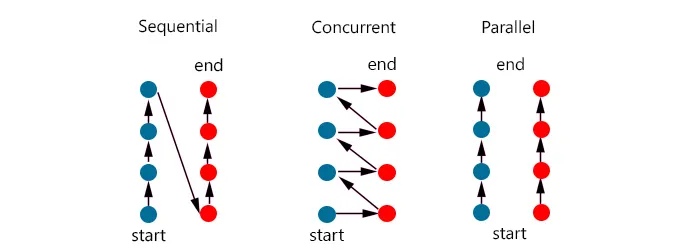
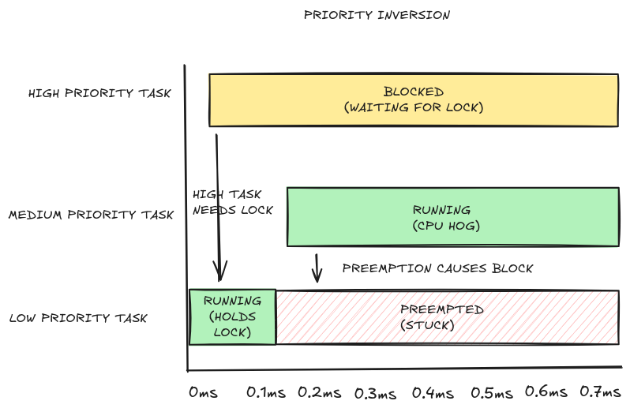

# Section 4

- **Section**: Linux System Programming
- **Topic**: Threads & Synchronization 
- **Duration**: 4 working days (8 hours/day) 

---
## Table of Contents

1. [Thread](#1-thread)
2. [Concurrency](#2-concurrency)
3. [Real-world Case Study: the Mars Pathfinder priority-inversion bug](#3-real-world-case-study-the-mars-pathfinder-priority-inversion-bug)
4. [Thread Synchronization](#4-thread-synchronization)

---
## 1. Thread 

### 1.1. Thread Concepts

Threads are a mechanism that permits an application to perform multiple tasks concurrently.

On a multiprocessor system, multiple threads can execute parallel.

A process can contain multiple threads.

||Process|Thread|
|-|-|-|
|**Definition**|An instance of a program that is in execution|A unit of execution within a process|
|**Memory**|Has its own separate address space|Shares the address space (code, data, heap) of its parent process|
|**Context switch**| Slow (Full memory map/page table switch)| Fast (Only registers/stack pointer switch)
|**Isolation**|A process crashing doesn't directly crash another|A thread crashing can crash the whole process|
|**Information sharing**|Difficult (Use IPC)|Easy (Use shared variables - global or heap)|

### 1.2 Thread Identification

Each thread within a process is uniquely identified by a thread ID.

```c
#include <pthread.h>

pthread_t pthread_self(void);

/* Returns the thread ID of the calling thread */
```

```c
#include <pthread.h>

int pthread_equal(pthread_t t1, pthread_t t2);

/* Returns nonzero value if t1 and t2 are equal, otherwise 0 */
```
The `pthread_equal()` function is needed because the `pthread_t` data type must be treated as opaque data. Do not use `==` for `pthread_t`.

POSIX thread IDs are not the same as the thread IDs returned by the Linux-specific `gettid()` system call.

### 1.3. Thread Creation 

```c
#include <pthread.h>

int pthread_create(pthread_t *thread, const pthread_attr_t *attr,
                void *(*start)(void *), void *arg);

/* Returns 0 on success, or a positive error number on error */
```

- `thread`: a pointer to a buffer of type `pthread_t`
- `attr`: a pointer to a `pthread_attr_t` object that specifies atrribtes for the new thread. Pass `NULL` for default attributes.
- `start`: a pointer to the startup function that the new thread begins executing. This function must take a single `void *` argument and return a `void *` 
- `arg`: an argument of type `void *` passed directly to `start`
    - `NULL`: no argument
    - A global/heap variable: A single argument
    - A struct with multiples fields: Multiple arguments

When a new thread created, there is no guarantee of whether the calling thread or the new thread will be scheduled to run first.

### 1.4. Thread Termination 

A thread terminates its execution in one of the following ways:
- Its `start` function performs a `return`
- It calls `pthread_exit()`
- It is canceled by another thread calling `pthread_cancel()`
- Any threads calls `exit()` or `main()` function performs a `return` => terminate all the threads in the process

```c
#include <pthread.h>

void pthread_exit(void *retval);
```

If the **main** thread calls `pthread_exit()` instead of calling `exit()` or performing a `return`, then the other threads continue to execute.

### 1.5. Joining with a Terminated Thread

`pthread_join()` is how one thread waits for another thread to finish, and collects its result before its resources are cleaned up.

```c
#include <pthread.h>

int pthread_join(pthread_t thread, void **retval);

/* Returns 0 on success, or a positive error number on error */
```

If a terminated thread never got joined or detached, it becomes a zombie thread.

Any thread in a process can use `pthread_join()` to join with any other thread in the process.

### 1.6. Detaching a Thread

Detaching a thread tells the system to automatically clean up the resource when it terminates.

Detached thread is not joinable.

```c
#include <pthread.h>

int pthread_detach(pthread_t thread);

/* Returns 0 on success, or a positive error number on error */
```

A thread can detach itself by:
```c
pthread_detach(pthread_self());
```

---
## 2. Concurrency and Mutual Exclusion

Concurrency is the ability of a system to handle multiple tasks during **overlapping time periods** (NOT *at the same time*).

### 2.1. Concurrency vs. Parallelism



**Sequential**: Tasks run one at a time, in order.

**Concurrency**: Multiple tasks make progress during **overlapping time periods**.

- Multiple tasks run on a single CPU core.
- Giving the illusion of "at the same time".

**Parallelism**: Multiple tasks execute at the same time, the exact same instant.

- Multiple tasks run on multiple cores/CPUs. 
- True simultaneity.

### 2.2. Why Concurrency is hard

**Race Conditions**
- Occurs when the outcome of a program depends on the timing of operations by multiple threads.
- Example: if two threads are trying to update a shared variable without proper synchronization, the final value of the variable can be unpredictable.

**Deadlocks**
- Occurs when 2 or more threads are waiting for each other to release resources => resulting in a situation where none of the thread can proceed

**Resource Management**
- Multiple threads accessing the same memory location can lead to data corruption without proper synchronization.

**Synchronization Overhead**
- Synchronization mechanisms, such as locks, semaphores, and mutexes, introduce overhead that can impact performance.

**Complexity of Debugging**
- Debugging concurrent programs is inherently more complex than debugging sequential programs.
- Issues such as race conditions and deadlocks can be difficult to reproduce and diagnose.

### 2.3. Mutual Exclusion

Mechanisms that ensures that one thread/process is doing certain things at one time (others are excluded)

---
## 3. Real-world Case Study: the Mars Pathfinder priority-inversion bug

**Priority Inversion**: A high priority task can become blocked by a lower priority task indefinitely, if lower priority task locks access to resources shared by both tasks.

**NASA Mars Pathfinder Bug**:
- Occured on NASA’s Mars Pathfinder mission in 1997.
- The rover had several tasks running at different priority levels:
    - *Low-priority* task: collecting data from the rover’s instruments.
    - *High-priority* task: handling critical operations that needed to run frequently.
    - *Medium-priority* task: performed communications and other background work.
- At one point:
    - *Low-priority* task acquired a mutex to collect data.
    - Before *low-priority* task could release the resource, *high-priority* task needed it.
    - Normally *low-priority* would finish quickly, but *medium-priority* task preempted it and hogged the CPU.
    - *High-priority* was stuck waiting for a *low-priority* that was unable to run.



=> The engineers fixed the issue using a mechanism called **priority inheritance**:
- When a *low-priority* task holds a resource needed by a *high-priority* task, the system temporarily boosts the *low-priority* task’s priority.

---
## 4. Thread Synchronization

### 4.1. Atomic & Non-atomic

**Non-atomic operation**
- Consists of multiple underlying steps. 
- Can be interrupted midway at any assembly instruction.

**Atomic operation**
- An operation that executes as a single, indivisible unit
- It either completes fully or doesn't start at all.
- Can never be interrupted or observed in a partially complete state.

### 4.2 Critical Section

**Critical section**
- A section of code that accesses a shared resource. 
- Its execution should be atomic.

An example about Critical section and Non-atomic operation in [Lab 1](#lab-1)

### 4.3. Mutex locks

#### Initializing Mutexes

***Statically Allocating a Mutex***

```c
pthread_mutex_t mtx = PTHREAD_MUTEX_INITIALIZER;
```

- Used for initializing a statically allocated mutex with default attributes

***Dynamically Initializing a Mutex***

```c
#include <pthread.h>

int pthread_mutex_init(pthread_mutex_t *mutex, const pthread_mutexattr_t *attr);

/* Returns 0 on success, or a positive error number on error */
```

- When a dynamically initialized mutex is no longer needed, it should be destroyed using 

    ```c
    #include <pthread.h>

    int pthread_mutex_destroy(pthread_mutex_t *mutex);

    /* Returns 0 on success, or a positive error number on error */
    ```


#### Locking and Unlocking a Mutex
```c
#include <pthread.h>

int pthread_mutex_lock(pthread_mutex_t *mutex);
int pthread_mutex_unlock(pthread_mutex_t *mutex);

/* Both return 0 on success, or a positive error number on error */
```


---
## 5. Reader-writer locks 
## 6. Reentrancy and Thread-Specific Data 
## 7. Threads and Signals, Threads and fork, Threads and I/O 
## 8. Condition Variables and Barriers 
## 9. Semaphores, Mutexes
## 10. Lock implementation
## 11. Deadlock

---
## 12. Lab

## Lab 1

Create and join multiple threads sharing a counter; observe a race condition on the unprotected shared data

[Link to lab 1](./lab/lab_1.c)

```c
#include <stdio.h>
#include <pthread.h>

long counter = 0; /* global variable */

void* increment(void* arg) /* thread function */
{
    for (int i = 0; i < 1000000; i++) 
    {
        counter++;   
    }
    return NULL;
}

int main() 
{
    pthread_t t1, t2;

    /* Create two threads that do the incrementing */
    pthread_create(&t1, NULL, increment, NULL);
    pthread_create(&t2, NULL, increment, NULL);

    /* Wait for both threads to complete */
    pthread_join(t1, NULL);
    pthread_join(t2, NULL);

    printf("Result: %ld (expected: 2000000)\n", counter);
    return 0;
}
```
Output:
```bash
$ ./lab_1
Result: 1345282 (expected: 2000000)
$ ./lab_1
Result: 1003811 (expected: 2000000)
$ ./lab_1
Result: 1098357 (expected: 2000000)
```

The expected result is 2000000. However, the actual result is lower than the expectation, and varies unpredictably between runs due to race condition. 

The `counter++` operation is non-atomic, it actually consists of 3 CPU instructions (Read-Modify-Write):

```asm
movq    counter(%rip), %rax ; 1. Read: Load counter data from memory into rax register
addq    $1, %rax            ; 2. Modify: Add 1 into rax
movq    %rax, counter(%rip) ; 3. Write: Store rax data back to counter variable
```

And the fact that `counter` is a shared resource makes `counter++` a critical section.

When those two threads run concurrently, instructions of 2 `++` operators can collide. 

Example of 2 `counter++` instructions colliding:

*Assuming that counter initially equals 5*


| Time | Thread 1 (eax_T1) | Thread 2 (eax_T2) | counter (RAM) |
|------|--------------------|--------------------|----------------|
| t1   | `movq counter,%rax` <br>→ eax_T1 = 5 |  | 5 |
| t2   |  | `movq counter,%rax` <br>→ eax_T2 = 5 | 5 |
| t3   | `addq 1, %rax` <br>→ eax_T1 = 6 |  | 5  |
| t4   |  | `addq $1, %rax` <br>→ eax_T2 = 6 | 5  |
| t5   | `movq %rax, counter` <br>→ writes 6 |  | **6** |
| t6   |  | `movq %rax, counter` <br>→ writes 6 | **6** |

The counter result is 6 instead of 7.

## Lab 2
Fix the race condition using a mutex lock; verify correctness under load

We fixed the race condition by protecting the critical section (`counter++`) using a mutex lock

```c
#include <stdio.h>
#include <pthread.h>

pthread_mutex_t mutex;
long counter = 0; /* global variable */

void* increment(void* arg) /* thread function */
{
    for (int i = 0; i < 1000000; i++) 
    {
        pthread_mutex_lock(&mutex);
        counter++;   
        pthread_mutex_unlock(&mutex);
    }
    return NULL;
}

int main() 
{
    pthread_mutex_init(&mutex, NULL);
    pthread_t t1, t2;

    /* Create two threads that do the incrementing */
    pthread_create(&t1, NULL, increment, NULL);
    pthread_create(&t2, NULL, increment, NULL);

    /* Wait for both threads to complete */
    pthread_join(t1, NULL);
    pthread_join(t2, NULL);

    printf("Result: %ld (expected: 2000000)\n", counter);

    pthread_mutex_destroy(&mutex);
    return 0;
}
```
Output:
```bash
$ ./lab_2
Result: 2000000 (expected: 2000000)
```

## Lab 3
Test the reentrancy (thread-safety) of a self-written function and fix it if it is not reentrant
## Lab 4
Implement a producer-consumer program using a mutex and a condition variable
## Lab 5
Reproduce a deadlock between two threads acquiring two locks in opposite order, then fix it via consistent lock ordering