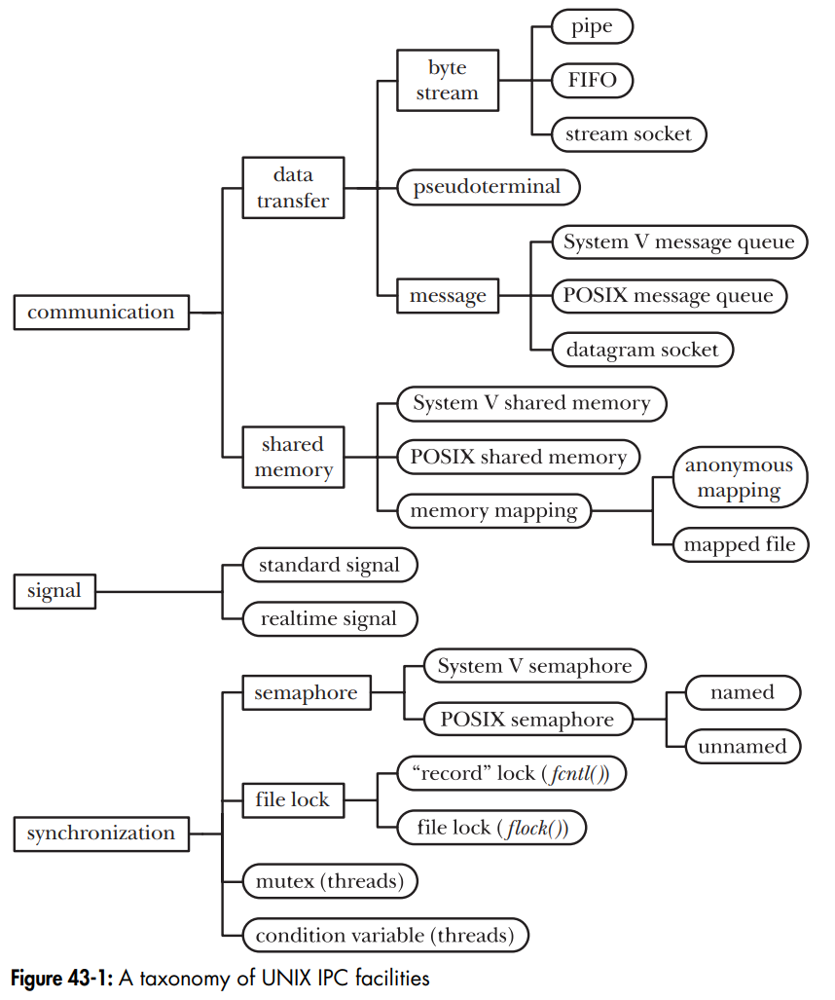
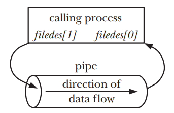
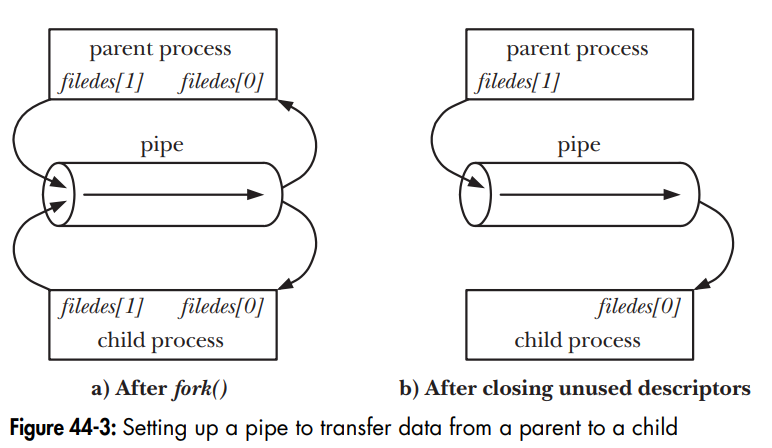
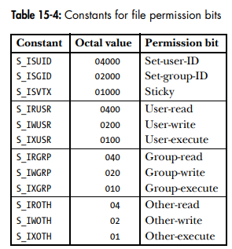

# Section 5

- **Section**: Linux System Programming
- **Topic**:  IPC: Pipes, FIFOs, Message Queues, Shared Memory, Signals 

---

## 1. Interprocess Communication Overview

Interprocess Communication (IPC) allows a process to communicate with another process.

UNIX IPC facilities are divided into thread broad functional categories:

- *Communication*: exchange data between processes
- *Synchronization*: synchronize the actions of processes or threads.
- *Signal*: software interrupts, can be used as a synchronization technique.



### 1.1. Communication Facilities

## 2. Pipes

### 2.1. Overview
A pipe is an unidirectional data channel.

**Reading behavior**:
- `read()` from an empty pipe blocks, until one byte is written.
- Once write end is closed and all buffered data has been read, `read()` returns 0.

**`PIPE_BUF` - atomic threshold**:
- Writes ≤ `PIPE_BUF` bytes are atomic guaranteed - multiple writers won't have their data interleaved.
- Writes > `PIPE_BUF`: kernel may split into smaller chunks interleaved with other writers' data.
- Value: 512 (FreeBSD 6.0), 4096 (Tru64 5.1, **Linux**), 5120 (Solaris 8).

**Pipe capacity**:
- A pipe is a kernel buffer with finite capacity; once full, writers block until a reader consumes data.
- *Linux kernels before 2.6.11*: pipe capacity = page size  (e.g., 4096 bytes on x86-32) <br> *Since Linux kernels 2.6.11*: pipe capacity = 65,536 bytes.

### 2.2. Creating and Using Pipes

```c
int pipe(int filedes[2]);
/* Returns 0 on success, or –1 on error */
```
The situation after a pipe has been created by `pipe()`:


During a `fork()`, the child process inherits copies of its parent’s file descriptors. 



After that, the sender process should closes its descriptor for the read end of the pipe, and the receiver should closes its descriptor for the write end.

Example:
```c
#include <stdio.h>

int main() 
{
    int filedes[2];

    if (pipe(filedes) == -1) 
    {
        perror("pipe");
        return -1;
    }

    switch (fork()) 
    {
        case -1:
            perror("fork");
            return -1;

        case 0: /* Child process */
            close(filedes[1]); /* Close unused write end */

            /* Child now reads from pipe */
            char buffer[100];
            read(filedes[0], buffer, sizeof(buffer));
            printf("Received from parent: %s\n", buffer);

            close(filedes[0]); /* Close read end */
            break;

        default: /* Parent process */
            close(filedes[0]); /* Close unused read end */

            /* Parent now writes to pipe */
            write(filedes[1], "Hello, child!", 14);

            close(filedes[1]); /* Close write end */
            break;
    }
    return 0;
}
```
Output
```
Received from parent: Hello, child!
```

### 2.3. popen()/pclose()

```c
FILE *popen(const char *command, const char *mode);
/* Returns file stream, or NULL on error */

int pclose(FILE *stream);
/* Returns termination status of child process, or –1 on error */
```
The `popen()` function:
- Create a pipe with `mode` (`r`- read from callee, `w` - write to callee).
- `fork()` and `exec()`: create a child process to execute `command`.
- Return a file stream pointer that can be used with `stdio` library functions.

`popen()` creates a pipe + child process so it must be closed with `pclose()`.

Example:
```c
#include <stdio.h>
#include <stdlib.h>

int main()
{
    char buffer[254];
    
    FILE *fp = popen("ls -l", "r"); /* read mode */

    if(fp == NULL) 
    {
        perror("popen");
        return -1;
    }

    /* Read the output line by line*/
    while(fgets(buffer, sizeof(buffer), fp) != NULL)
    {
        printf("%s", buffer);
    }

    pclose(fp);

    return 0;
}
```

```
total 64
-rw-r--r-- 1 dungvd dungvd   976 Sep 14 03:57 lab_1.c
-rwxr-xr-x 1 dungvd dungvd 16256 Sep 14 04:07 pipe
-rw-r--r-- 1 dungvd dungvd   950 Sep 14 04:33 pipe.c
-rwxr-xr-x 1 dungvd dungvd 16000 Sep 14 04:48 pipe2
-rw-r--r-- 1 dungvd dungvd   226 Sep 14 06:18 pipe2.c
-rwxr-xr-x 1 dungvd dungvd 16176 Sep 14 04:02 popen
-rw-r--r-- 1 dungvd dungvd   400 Sep 14 03:44 popen.c
```

`ls -l` writes its output into `stdout`, which is connected to a pipe. The parent process reads the output from the other end of the pipe.

### 2.4. FIFOs

FIFO is a named pipe. 

FIFO has a name within the file system and is opened in the same way as a regular file, allowing communication between unrelated processes.

```bash
$ mkfifo [ -m mode ] pathname
```

```c
#include <sys/stat.h>
int mkfifo(const char *pathname, mode_t mode);
/* Returns 0 on success, or –1 on error */
```
- `pathname`: the name of the FIFO to be created
- `mode`:

    


## Lab

### Lab 1
Implement a chat program between two processes over a pipe/FIFO 

### Lab 2
Implement producer-consumer via shared memory + semaphore 

### Lab 3
Register a signal handler for SIGINT/SIGALRM; use strace to observe all the IPC-related syscalls 