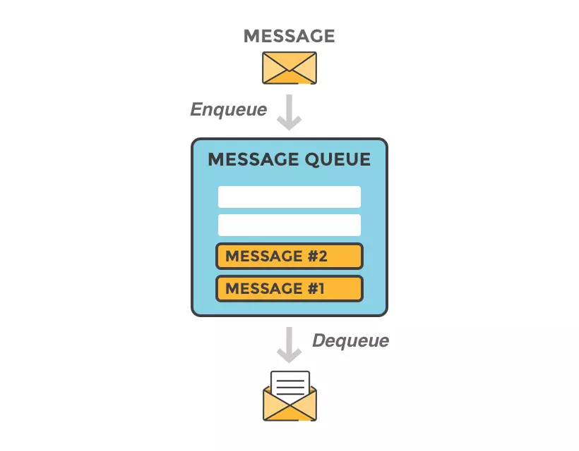
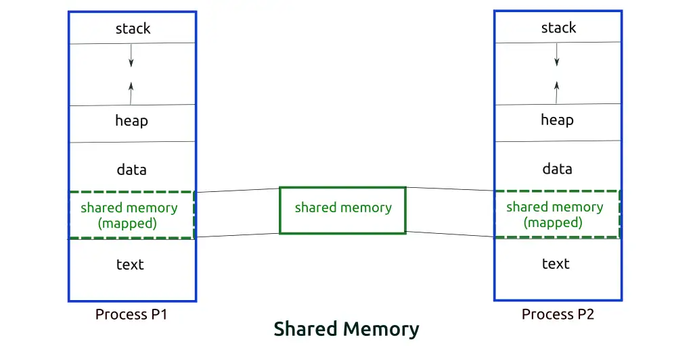
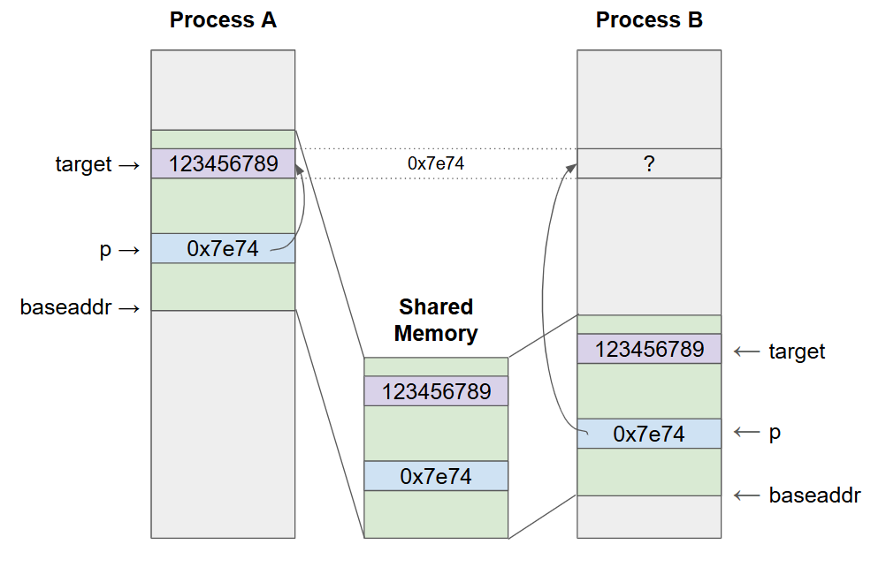

# Section 5

- **Section**: Linux System Programming
- **Topic**:  IPC: Pipes, FIFOs, Message Queues, Shared Memory, Signals 

---

## 1. Interprocess Communication Overview

Interprocess Communication (IPC) allows a process to communicate with another process.

UNIX IPC facilities are divided into thread broad functional categories:

- *Communication*: exchange data between processes
- *Synchronization*: synchronize the actions of processes or threads.
- *Signal*: software interrupts, can be used as a synchronization technique.


---

## 2. Pipes

### 2.1. Overview
A pipe is an unidirectional data channel.

**Reading behavior**:
- `read()` from an empty pipe blocks, until one byte is written.
- Once write end is closed and all buffered data has been read, `read()` returns 0.

**`PIPE_BUF` - atomic threshold**:
- Writes ≤ `PIPE_BUF` bytes are atomic guaranteed - multiple writers won't have their data interleaved.
- Writes > `PIPE_BUF`: kernel may split into smaller chunks interleaved with other writers' data.
- Value: 512 (FreeBSD 6.0), 4096 (Tru64 5.1, **Linux**), 5120 (Solaris 8).

**Pipe capacity**:
- A pipe is a kernel buffer with finite capacity; once full, writers block until a reader consumes data.
- *Linux kernels before 2.6.11*: pipe capacity = page size  (e.g., 4096 bytes on x86-32) <br> *Since Linux kernels 2.6.11*: pipe capacity = 65,536 bytes.

### 2.2. Creating and Using Pipes

```c
#include <unistd.h>

int pipe(int filedes[2]);
/* Returns 0 on success, or –1 on error */
```
The situation after a pipe has been created by `pipe()`:


During a `fork()`, the child process inherits copies of its parent’s file descriptors. 


After that:
- The sender should closes the read end of the pipe.
- The receiver should closes the write end of the pipe.

#### **Example 1**: Normal tranfer through pipe
```c
#include <stdio.h>
#include <unistd.h>

int main() 
{
    int filedes[2];

    if (pipe(filedes) == -1) 
    {
        perror("pipe");
        return -1;
    }

    switch (fork()) 
    {
        case -1:
            perror("fork");
            return -1;

        case 0: /* Child process */
            close(filedes[1]); /* Close unused write end */

            /* Child now reads from pipe */
            char buffer[100];
            while(read(filedes[0], buffer, sizeof(buffer)) > 0)
            {
                printf("Received from parent: %s\n", buffer);
            }

            close(filedes[0]); /* Close read end after writing */
            break;

        default: /* Parent process */
            close(filedes[0]); /* Close unused read end */

            /* Parent now writes to pipe */
            write(filedes[1], "Hello, child!", 14);

            close(filedes[1]); /* Close write end after reading */
            break;
    }

    return 0;
}
```
Output:
```
Received from parent: Hello, child!
```

#### **Example 2**: Self-deadlock since a process doesn't closing one end.

Same code on the example above, but we doesn't close the write end in the child process.

```c
case 0: /* Child process */
    /* close(filedes[1]); */ /* Write end now isn't closed*/

    /* Child now reads from pipe */
    char buffer[100];
    while(read(filedes[0], buffer, sizeof(buffer)) > 0)
    {
        printf("Received from parent: %s\n", buffer);
    }

    close(filedes[0]); /* Close read end after writing */
    break;
```
Output:
```
Received from parent: Hello, child!
```
We get the same output, main process ends successfully.

However, the child process is still running since it gets a self-deadlock. The pipe still has the write end in the child process, and `read()` blocks it from runnning.

```bash
$ ps aux | grep pipe_2
dungvd     44574  0.0  0.0   2772  1008 pts/2    S    04:01   0:00 ./pipe_2
```

### 2.3. popen()/pclose()

```c
FILE *popen(const char *command, const char *mode);
/* Returns file stream, or NULL on error */

int pclose(FILE *stream);
/* Returns termination status of child process, or –1 on error */
```
The `popen()` function:
- Create a pipe with `mode` (`r`- read from callee, `w` - write to callee).
- `fork()` and `exec()`: create a child process to execute `command`.
- Return a file stream pointer that can be used with `stdio` library functions.

`popen()` creates a pipe + child process so it must be closed with `pclose()`.

#### **Example**: `popen()` a `ls` command
```c
#include <stdio.h>
#include <stdlib.h>

int main()
{
    char buffer[254];
    
    FILE *fp = popen("ls -l", "r"); /* read mode */

    if(fp == NULL) 
    {
        perror("popen");
        return -1;
    }

    /* Read the output line by line*/
    while(fgets(buffer, sizeof(buffer), fp) != NULL)
    {
        printf("%s", buffer);
    }

    pclose(fp);

    return 0;
}
```

```
total 64
-rw-r--r-- 1 dungvd dungvd   976 Sep 14 03:57 lab_1.c
-rwxr-xr-x 1 dungvd dungvd 16256 Sep 14 04:07 pipe
-rw-r--r-- 1 dungvd dungvd   950 Sep 14 04:33 pipe.c
-rwxr-xr-x 1 dungvd dungvd 16000 Sep 14 04:48 pipe2
-rw-r--r-- 1 dungvd dungvd   226 Sep 14 06:18 pipe2.c
-rwxr-xr-x 1 dungvd dungvd 16176 Sep 14 04:02 popen
-rw-r--r-- 1 dungvd dungvd   400 Sep 14 03:44 popen.c
```

`ls -l` writes its output into `stdout`, which is connected to a pipe. The parent process reads the output from the other end of the pipe.

### 2.4. FIFOs

FIFO is a named pipe. 

FIFO has a name within the file system and is opened in the same way as a regular file, allowing communication between unrelated processes.

```bash
$ mkfifo [ -m mode ] pathname
```

```c
#include <sys/stat.h>
int mkfifo(const char *pathname, mode_t mode);
/* Returns 0 on success, or –1 on error */
```
- `pathname`: the name of the FIFO to be created
- `mode`:

    

#### **Example**: FIFO tranfer between a server and a client
```c
/* server.h */
#include <stdio.h>
#include <stdlib.h>
#include <unistd.h> 
#include <fcntl.h>
#include <sys/stat.h>
#include <signal.h>

void cleanup_fifo(int sig) 
{
    unlink("./my_fifo");
    exit(0);
}

int main()
{
    char buffer[254];

    /* Create a FIFO */
    mkfifo("./my_fifo", S_IRUSR | S_IWUSR | S_IRGRP | S_IROTH);

    /* Clean up the FIFO on SIGINT */
    signal(SIGINT, cleanup_fifo);

    while (1)
    {
        /* Open the FIFO for reading */
        int fd = open("./my_fifo", O_RDONLY);
        if (fd == -1) 
        {
            perror("open");
            return -1;
        }

        /* Read data from the FIFO */
        int bytes_read;
        while((bytes_read = read(fd, buffer, sizeof(buffer) - 1)) > 0)
        {
            buffer[bytes_read] = '\0';   // null-terminate the string
            printf("Received: %s\n", buffer);
        }

        /* Close the FIFO after sender is done */
        close(fd);
    }
     
    exit(0);
}
```
```c
/* client.h */
#include <stdio.h>
#include <stdlib.h>
#include <unistd.h> 
#include <fcntl.h>
#include <sys/stat.h>

const char *FIFO_NAME = "./my_fifo";
const int NUMBER_OF_MESSAGES = 5;

int main()
{
    /* Open the FIFO for writing */
    int fd = open(FIFO_NAME, O_WRONLY);
    if (fd == -1) 
    {
        perror("open");
        exit(-1);
    }

    /* Write messages to the FIFO */
    for(int i = 0; i < NUMBER_OF_MESSAGES; i++)
    {
        char message[50];
        snprintf(message, sizeof(message), "Message %d", i + 1);
        write(fd, message, sizeof(message));
        printf("Sent: %s\n", message);
        sleep(1); 
    }

    close(fd);
    exit(0);
}
```

The server is responsible for creating the FIFO for communication. Therefore, we start the server first:
```bash
$ ./server
Server is up. Waiting for messages...

```

A FIFO appears in the file directory:
```bash
$ ls
client  client.c  my_fifo  server  server.c
```

Let's run the client, then the server can receive it through `my_fifo`:
```bash
./client
Sent: Message 1
Sent: Message 2
Sent: Message 3
Sent: Message 4
Sent: Message 5
```
Server:
```
Server is up. Waiting for messages...
Received: Message 1
Received: Message 2
Received: Message 3
Received: Message 4
Received: Message 5
```

---

## 3. Introduction to System V IPC

### 3.1. IPC Identifiers and Keys

**IPC Identifier**: An **internal integer name** assigned by the kernel to reference an active IPC object. It is a property of the object itself and is visible system-wide.

**IPC Key**: An **external naming scheme** of data type `key_t` used by cooperating processes to locate and agree on the same IPC object. 

The **kernel** maintains data structures **mapping keys to identifiers** for each IPC mechanism.

**Inspecting IPC objects**:
```bash
$ ipcs        # list all IPC objects 
$ ipcs -q     # message queues only
$ ipcs -s     # semaphores only
$ ipcs -m     # shared memory only
$ ipcrm       # remove an IPC object by id
```

**Methods for generating IPC keys**:

1. Randomly choose some integer key value, placed in a header
file included by all programs using the IPC object (may accidentally choose a value used by another application)
1. Specifying `IPC_PRIVATE` guarantees that the kernel creates a new, unique IPC structure. 
    ```c
    /* create a message queue*/
    id = msgget(IPC_PRIVATE, S_IRUSR | S_IWUSR);
    ```
1. Generating Keys with `ftok()` (file to key):
    ```c
    #include <sys/ipc.h>
    key_t ftok(char *pathname, int proj);
    /* Returns integer key on success, or –1 on error */
    ```

### 3.2. Permission Structure

The associated data structure for an IPC object is initialized when the object is created via the appropriate `get` system call:

```c
struct ipc_perm {
    key_t           __key;  /* Key, as supplied to 'get' call */
    uid_t           uid;    /* Owner's user ID */
    gid_t           gid;    /* Owner's group ID */
    uid_t           cuid;   /* Creator's user ID */
    gid_t           cgid;   /* Creator's group ID */
    unsigned short  mode;   /* Permissions */
    unsigned short  __seq;  /* Sequence number */
};
```

### 3.3. Configuration Limits

**Message Queues**
- **MSGMAX** (`/proc/sys/kernel/msgmax`): The maximum allowable size of a single message (in bytes)
- **MSGMNB** (`/proc/sys/kernel/msgmnb`): The default maximum capacity for a single message queue (in bytes)
- **MSGMNI** (`/proc/sys/kernel/msgmni`): The limit on the total number of message queues

**Semaphores**  (`/proc/sys/kernel/sem`)
- **SEMMSL**: The maximum number of primitive semaphores per semaphore set.
- **SEMMNS**: The system-wide maximum number of semaphores across all sets.
- **SEMOPM**: The maximum number of operations permitted per `semop()` system call.
- **SEMMNI**: The system-wide maximum number of semaphore sets.

**Shared Memory**:
- **SHMMAX** (`/proc/sys/kernel/shmmax`): The maximum size of a single shared memory segment (in bytes)
- **SHMMNI** (`/proc/sys/kernel/shmmni`): The system-wide maximum number of shared memory segments
- **SHMALL** (`/proc/sys/kernel/shmall`): The total amount of shared memory, measured in pages, allocated system-wide.

**Pipes & FIFOs:**
- **PIPE_BUF**: The maximum number of bytes that can be written atomically to a pipe or FIFO without interleaving.
- **Pipe Capacity**: The maximum buffer capacity of a pipe (65,536 bytes since Linux 2.6.11), bounded per user by `/proc/sys/fs/pipe-max-size`

---

## 4. Message Queues

Message queues allow processes to exchange data in the form of messages.



Communication via message queues is message-oriented => the reader receives whole messages written by the writer.

It is **NOT possible** to:
- Read part of a message
- Leaving remainder in the queue
- Read multiple messages at a time

### 4.1. System V Message Queues

|Interface|Message queues|
|-|-|
|Header file|`<sys/msg.h>`|
|Associated data structure|`msqid_ds`|
|Create/open object|`msgget()`|
|Close object|(none)|
|Control operations|`msgctl()`|
|Performing IPC|`msgsnd()`-write message<br>`msgrcv()`-read message|

#### 4.1.1. Creating or Opening a Message Queue
```c
int msgget(key_t key, int msgflg);
/* Returns message queue identifier on success, or –1 on error */
```

- `msgflg`:
    - File permission bits.
    - `IPC_CREAT`: If no message queue with the specified key exists, create a new queue.
    - `IPC_EXCL`: If IPC_CREAT was also specified, and a queue already exists, fail with the error `EEXIST`

#### 4.1.2. Sending Messages
```c
int msgsnd(int msqid, const void *msgp, size_t msgsz, int msgflg);
/* Returns 0 on success, or –1 on error */
```
- `msgp`: Pointer to a programmer-defined structure:
    ```c
    struct mymsg {
        long mtype;     /* Message type */
        char mtext[];   /* Message body */
    }
    ```
- `msgsz`: Size of `mtext` in bytes.
- `msgflg`:
    - `IPC_NOWAIT`: Perform a nonblocking send, and return `EAGAIN` when the queue is full.

A `msgsnd()` call that is blocked by a full queue may be interrupted by a signal handler. In this case, it fails with the error `EINTR`.

#### 4.1.3. Receiving Messages

```c
ssize_t msgrcv(int msqid, void *msgp, size_t maxmsgsz, long msgtyp, int msgflg);
/* Returns number of bytes copied into mtext field, or –1 on error */
```

`msgrcv()`: reads and removes a message from a message queue, and copies its contents into the buffer pointed to by msgp

- `maxmsgsz`: Maximum space of the buffer <br> If `mtext` size > `maxmsgsz`, no message is removed and fails with the error `E2BIG`.
- `msgtyp`:
    - `== 0`: Take the first msg from the queue.
    - `> 0`: Take the first msg whose `mtype == msgtyp`.
    - `< 0`: Take the first msg with the smallest `mtype`
    such that `mtype <= abs(msgtyp)`.
- `msgflg`:
    - `IPC_NOWAIT`: Perform a nonblocking receive, and return `ENOMSG` when the queue is empty.
    - `MSG_EXCEPT`: If `msgtyp > 0`, Take the first msg whose `mtype != msgtyp`
    - `MSG_NOERROR`: If `mtext` size > `maxmsgsz`, take the msg by truncating the msg.

#### 4.1.4. Message Queue Control Operations
```c
int msgctl(int msqid, int cmd, struct msqid_ds *buf);
/* Returns 0 on success, or –1 on error */
```
- `IPC_RMID`: Immediately remove the message queue object, ignore the third argument.
- `IPC_STAT`: Get a copy of `msqid_ds` associated with this msg queue.
- `IPC_SET`: Update selected fields of `msqid_ds` associated with this msg queue.

```c
struct msqid_ds {
    struct ipc_perm msg_perm; /* Ownership and permissions */
    time_t msg_stime; /* Time of last msgsnd() */
    time_t msg_rtime; /* Time of last msgrcv() */
    time_t msg_ctime; /* Time of last change */
    unsigned long __msg_cbytes; /* Number of bytes in queue */
    msgqnum_t msg_qnum; /* Number of messages in queue */
    msglen_t msg_qbytes; /* Maximum bytes in queue */
    pid_t msg_lspid; /* PID of last msgsnd() */
    pid_t msg_lrpid; /* PID of last msgrcv() */
};
```

#### **Example**: Sending a `long` value through a message queue
```c
#include <stdio.h>
#include <stdlib.h>
#include <unistd.h>
#include <sys/types.h>
#include <sys/msg.h>
#include <string.h>

typedef struct MyMsg {
    long mtype;     
    char mtext[1024];   
} MyMsg;

int main() 
{
    int msgid = msgget(123456, IPC_CREAT | 0666);

    if(msgid == -1) 
    {
        perror("msgget");
        return -1;
    }

    switch (fork()) 
    {
        case -1:
            perror("fork");
            return -1;

        case 0: /* Child process recv */
            const int BUFFER_SIZE = 1024;
            MyMsg recv_msg;

            /* Receive a message from the message queue */
            msgrcv(msgid, &recv_msg, BUFFER_SIZE, 0, 0);

            /* Extract the long value from the message text */
            long recv_key;
            memcpy(&recv_key, recv_msg.mtext, sizeof(long));
            
            printf("Received msg: %li \n", recv_key);

            break;

        default: /* Parent process send */
            /* Initialize a message*/
            MyMsg send_msg;
            send_msg.mtype = 1;

            /* Send a long value by copying it to the message text */
            long super_important_key = 1234567890123456789;
            memcpy(send_msg.mtext, &super_important_key, sizeof(long));

            /* Send message to message queue*/
            msgsnd(msgid, &send_msg, sizeof(send_msg.mtext), 0);

            break;
    }

    return 0;
}
```

Output:
```
Received msg: 1234567890123456789
```

---

## 5. Semaphores

### 5.1. System V Semaphores

|Interface|Semaphores|
|-|-|
|Header file|`<sys/sem.h>`|
|Associated data structure|`semid_ds`|
|Create/open object|`semget()`|
|Close object|(none)|
|Control operations|`semctl()`|
|Performing IPC|`semop()`-test/adjust semaphore|

#### 5.1.1. Creating or Opening a Semaphore Set
```c
int semget(key_t key, int nsems, int semflg);
/* Returns semaphore set identifier on success, or –1 on error */
```

#### 5.1.2. Semaphore Control Operations

### 5.2. POSIX Semaphores

Mentioned in [section 4](../section-4/)

---

## 6. Shared Memory

Shared memory allows ≥ 2 processes to share the same region of physical memory.

This is the fastest form of IPC, because the data doesn't need to be copied between processes.

A shared memory segment is mapped to be part of a process's user-space memory, no kernel intervention is required for IPC.



Processes should implement a **synchronization technique** to access a shared memory.

### 6.1. System V Shared Memory

|Interface|Message queues|
|-|-|
|Header file|`<sys/shm.h>`|
|Associated data structure|`msqid_ds`|
|Create/open object|`shmget()` + `shmat()`|
|Close object|`shmdt()`|
|Control operations|`shmctl()`|
|Performing IPC|access memory in shared region|

#### 6.1.1. Creating, Opening a Shared Memory Segment

`shmget()` creates a new shared memory segment or opening an existing segment
```c
int shmget(key_t key, size_t size, int shmflg);
/* Returns shared memory segment identifier on success, or –1 on error */
```
- `size`: the desired size of the segment, in bytes (positive int)<br>The kernel allocates shared memory in **multiples of the system page size**.
- `shmflg`: 
    - permission bits
    - `IPC_CREAT`, `IPC_EXCL`
    - `SHM_HUGETLB` (since Linux 2.6): create a shared memory that uses *huge pages*.
    - `SHM_NORESERVE` (since Linux 2.6.15)

#### 6.1.2. Attaching, Detaching a Shared Memory Segment

`shmat()` attaches the shared memory segment to the calling's virtual address space.
```c
void *shmat(int shmid, const void *shmaddr, int shmflg);
/* Returns address at which shared memory is attached on success, or (void *) –1 on error */
```
- `shmaddr`: 
    - `NULL`: Attach segment at a suitable address selected by the kernel (preferred method).
    - not `NULL`: Attach segment at the address specified by `shmaddr`, which must be a multiple of the system page size (or the error `EINVAL` results).
    - not `NULL`, `SHM_RND` is set: Attach segment at the address specified by `shmaddr`, round `shmaddr` down to multiple of `SHMLBA`.

- `shmflg`:
    - `0`: Default
    - `SHM_RDONLY`: Attach segment read-only
    - `SHM_REMAP`: Replace any existing mapping at `shmaddr`
    - `SHM_RND`: Round `shmaddr` down to multiple of `SHMLBA` (use with `shmaddr != NULL`)

`shmdt()`: detact the segment from its virtual address space. NOT deleting the shared memory.

```c
int shmdt(const void *shmaddr);
/* Returns 0 on success, or –1 on error */
```

- `shmaddr`: the address returned by `shmat()`

#### 6.1.3. Shared Memory Control Operations

```c
int shmctl(int shmid, int cmd, struct shmid_ds *buf);
/* Returns 0 on success, or –1 on error */
```

Generic operations:
- `IPC_RMID`: Marks the segment for deletion.
    - If no process has the segment attached, immediately remove; otherwise removal happens once after all processes have detached from it.
- `IPC_STAT`: Copies the segment's `shmid_ds` structure into `buf`.
- `IPC_SET`: Updates selected fields of the segment's `shmid_ds` structure from `buf`.

Locking operations:
- `SHM_LOCK`: Locks the segment into RAM so it can't be swapped out, avoiding page-fault delays once pages are resident.
- `SHM_UNLOCK`: Unlocks it, allowing swapping again.

```c
struct shmid_ds {
    struct ipc_perm shm_perm; /* Ownership and permissions */
    size_t shm_segsz; /* Size of segment in bytes */
    time_t shm_atime; /* Time of last shmat() */
    time_t shm_dtime; /* Time of last shmdt() */
    time_t shm_ctime; /* Time of last change */
    pid_t shm_cpid; /* PID of creator */
    pid_t shm_lpid; /* PID of last shmat() / shmdt() */
    shmatt_t shm_nattch; /* Number of currently attached processes */
};
```

#### **Example 1**: Shared memory is allocated in multiples of the system page size

Let's try creating a shared memory with only 10 bytes
```c
#include <stdio.h>
#include <sys/shm.h>
#include <unistd.h>

int main()
{
    int shm_size = 10;

    /* Create a new shared memory segment */
    int shmid = shmget(IPC_PRIVATE, shm_size, IPC_CREAT | 0666);
    if (shmid == -1) 
    {
        perror("shmget");
        return -1;
    }

    /* Attach the segment to virtual memory */
    void *baseaddr = shmat(shmid, NULL, 0);
    if (baseaddr == (void *)-1) 
    {
        perror("shmat");
        return -1;
    }
    
    /* Mark for removal when no processes attached */
    shmctl(shmid, IPC_RMID, NULL); 

    printf("Shared memory attached at: %p\n", baseaddr);
    printf("Process ID: %d\n", getpid());

    getchar(); 
    shmdt(baseaddr); /* Detach the segment */
    return 0;
}
```

Output:
```
Shared memory attached at: 0x706c1ed53000
Process ID: 41006
```

Inspection:
```bash
$ ipcs -m

------ Shared Memory Segments --------
key        shmid      owner      perms      bytes      nattch     status
0x00000000 14         dungvd     666        10         1
```
`ipcs` shows that we have a 10-byte shared memory

```bash
$ pmap -x 41006
Address           Kbytes     RSS   Dirty Mode  Mapping
...
0000706c1ed53000       4       0       0 rw-s-   [ shmid=0xe ]
...
```
But when we use `pmap` to inspect the memory map, the shared memory is 4kB = 4096 bytes large, which is a multiple of system page size:
```bash
$ getconf PAGESIZE
4096
```

### 6.2. POSIX Shared Memory

### 6.3. Storing Pointers in Shared Memory

Each process may employ different shared libraries and memory mappings, and may attach different sets of shared memory segments.

It is unsafe to storing absolute pointers inside shared memory segments. 



Pointer offsets to base address return from `shmat()` should be used instead.

#### **Example**: Reproduce an error due to using storing an absolute pointer in a shared memory
```c
/* writer */
#include <stdio.h>
#include <sys/shm.h>

int main()
{
    /* Create a new shared memory segment */
    int shmid = shmget(123, 4096, IPC_CREAT | 0666);
    if (shmid == -1) 
    {
        perror("shmget");
        return -1;
    }

    /* Attach the segment to virtual memory */
    long *baseaddr = shmat(shmid, NULL, 0);
    if (baseaddr == (void *)-1) 
    {
        perror("shmat");
        return -1;
    }
    
    /* Pointers for referencing the shared memory */
    long *p = &baseaddr[1]; 
    long *target = &baseaddr[50];
    
    /* Store a value in the shared memory */
    *target = 123456789;

    /* Store a pointer to target in the shared memory */
    *p = (long)target; /* Convert address to long*/

    /* Access the shared memory */
    printf("Memory addresses:\n");
    printf("- baseaddr of shared memory: %p\n", baseaddr);
    printf("- p in shared memory: %p\n", p);
    printf("- target in shared memory: %p\n", target);

    printf("Values:\n");
    printf("- target value: %ld\n", *target);
    printf("- p value: %p\n", (long *)*p);
    printf("- p dereferenced value: %ld\n", *(long *)(*p));
    
    /* Detach the segment */
    shmdt(baseaddr); 
    return 0;
}
```

```c
/* reader */
#include <stdio.h>
#include <sys/shm.h>

int main()
{
    /* Open an existed shared memory segment */
    int shmid = shmget(123, 4096, 0666);
    if (shmid == -1) 
    {
        perror("shmget");
        return -1;
    }

    /* Attach the segment to virtual memory */
    long *baseaddr = shmat(shmid, NULL, 0);
    if (baseaddr == (void *)-1) 
    {
        perror("shmat");
        return -1;
    }

    /* Mark for removal */
    shmctl(shmid, IPC_RMID, NULL); 
    
    /* Pointers for referencing the shared memory */
    long *p = &baseaddr[1]; 
    long *target = &baseaddr[50];
    
    // *target = 123456789;
    // *p = (long)target; 

    /* Access the shared memory */
    printf("Memory addresses:\n");
    printf("- baseaddr of shared memory: %p\n", baseaddr);
    printf("- p in shared memory: %p\n", p);
    printf("- target in shared memory: %p\n", target);

    printf("Values:\n");
    printf("- target value: %ld\n", *target);
    printf("- p value: %p\n", (long *)*p);
    printf("- p dereferenced value: %ld\n", *(long *)(*p));
    
    /* Detach the segment */
    shmdt(baseaddr); 
    return 0;
}
```
Output:
```bash
$ ./writer 
Memory addresses:
- baseaddr of shared memory: 0x7e74316fd000
- p in shared memory: 0x7e74316fd008
- target in shared memory: 0x7e74316fd190
Values:
- target value: 123456789
- p value: 0x7e74316fd190
- p dereferenced value: 123456789
```
```bash
$ ./reader
Memory addresses:
- baseaddr of shared memory: 0x7db4b7e11000
- p in shared memory: 0x7db4b7e11008
- target in shared memory: 0x7db4b7e11190
Values:
- target value: 123456789
- p value: 0x7e74316fd190
Segmentation fault         [ -x /usr/lib/command-not-found ]
```

As we can see that, the base addresses of the attached shared memory in these 2 processes' virtual memories are different, causing:
- `target` (stored in `baseaddr + 50`) is mapped to different addresses in 2 processes (`0x7e74316fd190` vs `0x7db4b7e11190`).
- the absolute pointer `p` (stored in `baseaddr + 1`, value `0x7e74316fd190`) is unable to work properly in the reader process, it points to an unallocated address. => Causing Segmentation fault 

---

## 7. Signals

## Lab

### Lab 1
Implement a chat program between two processes over a pipe/FIFO 

### Lab 2
Implement producer-consumer via shared memory + semaphore 

### Lab 3
Register a signal handler for SIGINT/SIGALRM; use strace to observe all the IPC-related syscalls 