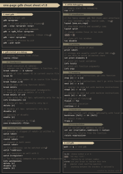

# Section 6

**Section**: Linux System Programming 

**Topic**: Userspace Debugging Toolkit: GDB, strace & Valgrind

**Purpose**: Learn to systematically diagnose userspace C program problems using the three essential Linux debugging tools instead of relying on printf-debugging, each answering a different question: GDB - what is my code doing; strace - what is my program asking the OS to do; Valgrind - is my program misusing memory. 

**Expectation**: Debugging report covering all three tools: one crash root-caused with GDB (including a core dump), one hang/failure diagnosed with strace, and one memory bug found with Valgrind

---

## 1. GDB

GDB, the GNU Project debugger, allows you to see what is going on `inside' another program while it executes - or what another program was doing at the moment it crashed.

When compiling a C program, it should be compiled with the flag `-g`:

- Without `-g`: 
    - The executable mainly contains the machine code.
    - GDB can still debug the machine instructions, but the debugging becomes much more low-level.

- With `-g`:
    - GCC adds debugging information to the executable.
        ```
        machine code
        +
        debug information
                │
                ├── address → source file + line
                ├── address → function
                ├── variable → type/location
                └── source-level information
      ```
    - The debugging information gives translation between machine-level execution and source-level concepts.

### 1.1. Debugger concepts

**Breakpoints**: pause execution at a specific point

**Conditional breakpoints**: pause execution at a specific point when a condition is hit

**Continue**: run until next breakpoint

**Watchpoints**: pause execution when a memory location is accessed (write/read)

**Stepping**:

- ***Step (into)***: execute one source line; if it's a call, follow into the callee.
- ***Next (over)***: execute one source line; if it's a call, run it to completion without stopping inside
- ***Finish (out)***: run until the current function returns

### 1.2. Cheatsheet



### 1.3. Stack traces

A stack trace (backtrace) is a report of the active stack frames at a certain point in time during the execution of a program.

**Example**:

```c
#include <stdio.h>

void demo3()
{
    printf("Hello");
}

void demo2()
{
    demo3();
}

void demo1()
{
    demo2();
}

void demo()
{
    demo1();
}

int main()
{
    demo();
    return 0;
}

```

**GDB**:

Set a breakpoint at line 5:
```
(gdb) b 5
```
Run and do a backtrace:
```
(gdb) run
Breakpoint 1, demo3 () at backtrace.c:5
5           printf("Hello");
(gdb) backtrace
#0  demo3 () at backtrace.c:5
#1  0x0000555555555175 in demo2 () at backtrace.c:10
#2  0x0000555555555185 in demo1 () at backtrace.c:15
#3  0x0000555555555195 in demo () at backtrace.c:20
#4  0x00005555555551a5 in main () at backtrace.c:25
```

### 1.4. Core dumps

A core dump consists of the recorded state of the working memory of a computer program at a specific time, generally when the program has crashed or otherwise terminated abnormally.

Setup by remove the shell's size limit on core dumps.
```bash
$ ulimit -c unlimited # Set core-dump limit to unlimited
$ ulimit -c # Shows the current core-dump limit
unlimited
```

Load a core dump with GDB by:
```bash
$ gdb <executable> <coredump>
```

### 1.3. Multi-thread debugging

**Thread Inspection**

|Command|Effect|
|-|-|
|`info threads`|List all threads, current one marked with *|
|`thread <N>`|Switch focus to thread `N` (GDB's own numbering)|
|`thread apply <N> <cmd>`|Run `<cmd>` in thread N without switching|
|`thread apply all <cmd>`|Run `<cmd>` in every thread|
|`thread apply all bt`|Backtrace of every thread — most-used command in deadlock/hang debugging|
|`thread find <regex>`|Find threads whose name/function matches regex|
|`thread name <name>`|Assign a name to current thread (cosmetic)|

**Breakpoints per Thread**

```bash
break worker.c:20 thread 2          # only stops when thread 2 hits it
break foo if thread == 3            # equivalent, condition form
condition 1 thread == 2             # add thread condition to existing bp N=1
```

Combine with a normal condition:

```bash
break foo thread 2 if x > 10
```

Watchpoints work the same way and are thread-aware:

```bash
watch shared_counter thread 2
```

### 1.4. Multi-process debugging

---

## 2. strace

`strace` is a Linux command-line tool that intercepts and records system calls and signals made by a process to debug and analyze its behavior

## 3. Valgrind

Valgrind is an instrumentation framework for building dynamic analysis tools. It comes with a set of tools each of which performs some kind of debugging, profiling, or similar task that helps improve programs.

A number of useful tools are supplied in Valgrind:

1. *Memcheck*: a memory error detector
2. *Cachegrind*: a cache and branch-prediction profiler
3. *Callgrind*: a call-graph generating cache profiler
4. *Helgrind*: a thread error detector
5. *DRD*: a thread error detector
6. *Massif*: a heap profiler
7. *DHAT*: a heap profiler
8. *BBV*: an experimental SimPoint basic block vector generator

In this section, we only focus on `Memcheck`

### 4.1. Memory leaks

Memory leaks occur when we allocate memory but never free it.

**Example**:

```c
#include <stdio.h>
#include <stdlib.h>
#include <string.h>

int main()
{
    char *str = malloc(20);
    strcpy(str, "Hello, World!");
    printf("%s\n", str);

    return 0;
}
```

```bash
$ valgrind --leak-check=full ./mem_leak 
...
==58861== HEAP SUMMARY:
==58861==     in use at exit: 20 bytes in 1 blocks
==58861==   total heap usage: 2 allocs, 1 frees, 1,044 bytes allocated
==58861== 
==58861== 20 bytes in 1 blocks are definitely lost in loss record 1 of 1
==58861==    at 0x4850858: malloc (vg_replace_malloc.c:447)
==58861==    by 0x400117E: main (mem_leak.c:7)
==58861== 
==58861== LEAK SUMMARY:
==58861==    definitely lost: 20 bytes in 1 blocks
==58861==    indirectly lost: 0 bytes in 0 blocks
==58861==      possibly lost: 0 bytes in 0 blocks
==58861==    still reachable: 0 bytes in 0 blocks
==58861==         suppressed: 0 bytes in 0 blocks
...
```

**Fix**:
```c
#include <stdio.h>
#include <stdlib.h>
#include <string.h>

int main()
{
    char *str = malloc(20);
    strcpy(str, "Hello, World!");
    printf("%s\n", str);

    free(str); /* Free after use */
    return 0;
}
```

```bash
$ valgrind --leak-check=full ./mem_leak 
...
==58803== HEAP SUMMARY:
==58803==     in use at exit: 0 bytes in 0 blocks
==58803==   total heap usage: 2 allocs, 2 frees, 1,044 bytes allocated
==58803== 
==58803== All heap blocks were freed -- no leaks are possible
...
```

### 4.2. Invalid reads/writes

Invalid reads/writes occur when:
- Accessing memory outside the bound of what was allocated.
- Deferencing a pointer that doesn't point to anything meaningful

**Example**:

```c
#include <stdio.h>
#include <stdlib.h>
#include <string.h>

int main()
{
    char *str = malloc(10);
    strcpy(str, "0123456789");

    free(str);
    return 0;
}
```
```bash
$ valgrind -s ./invalid_rw
...
==8706== ERROR SUMMARY: 1 errors from 1 contexts (suppressed: 0 from 0)
==8706==
==8706== 1 errors in context 1 of 1:
==8706== Invalid write of size 4
==8706==    at 0x4001194: main (invalid_rw.c:8)
==8706==  Address 0x4a91047 is 7 bytes inside a block of size 10 alloc'd
==8706==    at 0x4850858: malloc (vg_replace_malloc.c:447)
==8706==    by 0x400117E: main (invalid_rw.c:7)
==8706==
==8706== ERROR SUMMARY: 1 errors from 1 contexts (suppressed: 0 from 0)
```

### 4.3. Use-after-free

Use-after-free occurs when we keep using the pointer after having freed it

```c
#include <stdio.h>
#include <stdlib.h>

int main()
{
    int *i = malloc(sizeof(int));
    *i = 10;

    free(i);

    printf("%d\n", *i); /* Use after free */
    return 0;
}
```

```bash
$ valgrind ./use_after_free
...
==10272== Invalid read of size 4
==10272==    at 0x40011BD: main (use_after_free.c:12)
==10272==  Address 0x4a91040 is 0 bytes inside a block of size 4 free'd
==10272==    at 0x48538BF: free (vg_replace_malloc.c:990)
==10272==    by 0x40011B8: main (use_after_free.c:10)
==10272==  Block was alloc'd at
==10272==    at 0x4850858: malloc (vg_replace_malloc.c:447)
==10272==    by 0x400119E: main (use_after_free.c:7)
...
```

Block was alloc'd

### 4.4. Uninitialized memory

**Example**:

```c
#include <stdio.h>
#include <stdlib.h>

int main()
{
    int *i = malloc(sizeof(int));

    printf("%d\n", *i); /* Use of uninitialized memory */

    free(i);    
    return 0;
}
```

```bash 
$ valgrind --track-origins=yes ./uninitialized
...
==12857== Use of uninitialised value of size 8
==12857==    at 0x48D0062: _itoa_word (_fitoa_word.c:38)
==12857==    by 0x48DB61C: __printf_buffer (vfprintf-process-arg.c:155)
==12857==    by 0x48DD767: __vfprintf_internal (vfprintf-internal.c:1548)
==12857==    by 0x48D1132: printf (printf.c:33)
==12857==    by 0x40011BE: main (uninitialized.c:8)
==12857==  Uninitialised value was created by a heap allocation
==12857==    at 0x4850858: malloc (vg_replace_malloc.c:447)
==12857==    by 0x400119E: main (uninitialized.c:6)
...
```

## 4. Lab

### Lab 1
Compile a program with a deliberately introduced segfault; debug it live with GDB (breakpoints/backtrace) and then again by loading a generated core dump

```c
#include <stdio.h>
#include <string.h>
#include <stdlib.h>

char *buf;

int sum_to_n(int num)
{
    int i, sum = 0;
    for (i = 1; i <= num; i++)
        sum += i;
    return sum;
}

void printSum()
{
    char line[10];
    printf("enter a number:\n");
    fgets(line, 10, stdin);
    if (line != NULL)
        strtok(line, "\n");
    int sum = sum_to_n(atoi(line));
    sprintf(buf, "sum=%d", sum);
    printf("%s\n", buf);
}

int main(void)
{
    printSum();
    return 0;
}
```
```bash
$ gcc -g lab_1.c -o lab_1
```

Output:
```bash
$ ./lab_1
enter a number:
5
Segmentation fault         ./lab_1
```

After setting up the core-dump limit, the kernel can produce a core dump for our program when segfault (`core.11314` in this case)

```bash
$ ls | grep core
core.11314
```

Load the core dump with GDB:

```bash
$ gdb ./lab_1 ./core.11314
...
Core was generated by `./lab_1'.
Program terminated with signal SIGSEGV, Segmentation fault.
#0  __memcpy_evex_unaligned_erms () at ../sysdeps/x86_64/multiarch/memmove-vec-unaligned-erms.S:289
...
```

Do a backtrace:

```bash
(gdb) bt
#0  __memcpy_evex_unaligned_erms () at ../sysdeps/x86_64/multiarch/memmove-vec-unaligned-erms.S:289
#1  0x000075d49b264d68 in __GI_memcpy (__dest=<optimized out>, __src=<optimized out>, __len=4)
    at ../string/bits/string_fortified.h:29
#2  __printf_buffer_write (buf=buf@entry=0x7fff4086e040, s=<optimized out>, s@entry=0x60c487aaa016 "sum=%d",
    count=count@entry=4) at ./stdio-common/Xprintf_buffer_write.c:39
#3  0x000075d49b26dacd in __printf_buffer (buf=buf@entry=0x7fff4086e040, format=0x60c487aaa016 "sum=%d",
    ap=ap@entry=0x7fff4086e090, mode_flags=mode_flags@entry=0) at ./stdio-common/vfprintf-internal.c:652
#4  0x000075d49b28f76c in __vsprintf_internal (string=<optimized out>, maxlen=maxlen@entry=18446744073709551615,
    format=<optimized out>, args=args@entry=0x7fff4086e090, mode_flags=mode_flags@entry=0)
    at ./libio/iovsprintf.c:62
#5  0x000075d49b26a887 in __sprintf (s=<optimized out>, format=<optimized out>) at ./stdio-common/sprintf.c:30
#6  0x000060c487aa92aa in printSum () at lab_1.c:23
#7  0x000060c487aa92dd in main () at lab_1.c:29
```

In this backtrace, frame #6 shows the crash originates from our own code at `lab_1.c:23`:

```c
sprintf(buf, "sum=%d", sum);
```

Furthermore, on the upper stack frame (#0-#5), there was a problem with some kind of `memcpy` action => maybe `sprintf` failed to copy data to `buf`. Let's investigate the `char *buf` variable.

```bash
(gdb) print buf
$1 = 0x0
```

=> That's the problem. The pointer `buf` was pointed to `NULL` => `buf` wasn't got allocated.

### Lab 2
Debug a multi-threaded program with GDB (thread apply all bt) to locate a race-condition-induced crash

### Lab 3
Run strace on a program that hangs or fails silently; use the syscall trace (files/sockets/processes/permissions/signals) to find the root cause

### Lab 4
Run Valgrind (memcheck) on a program with a deliberately introduced memory leak and a use-after-free bug; interpret the report and fix both

Mention in 4.