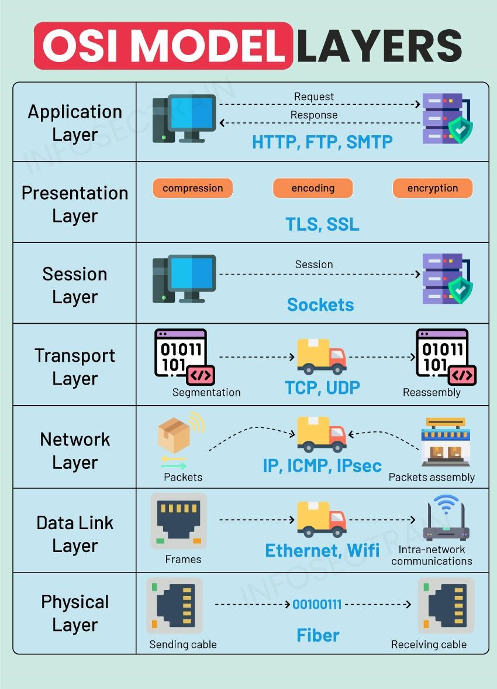
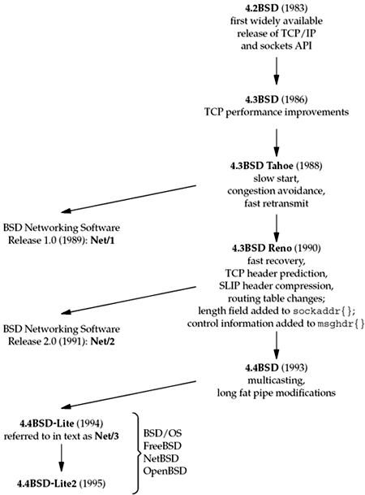
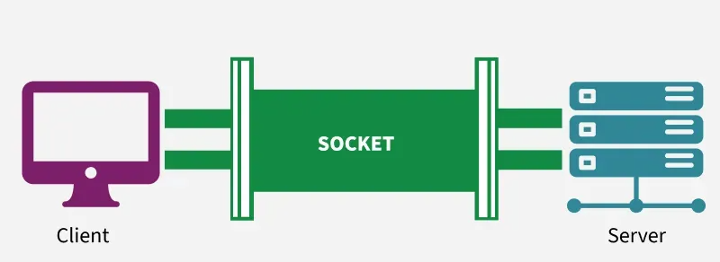
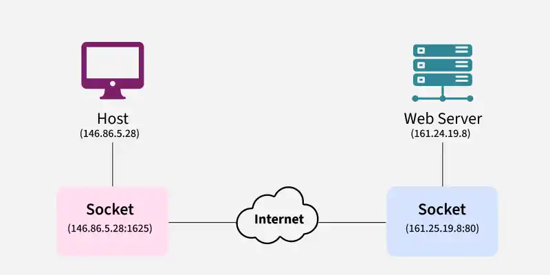
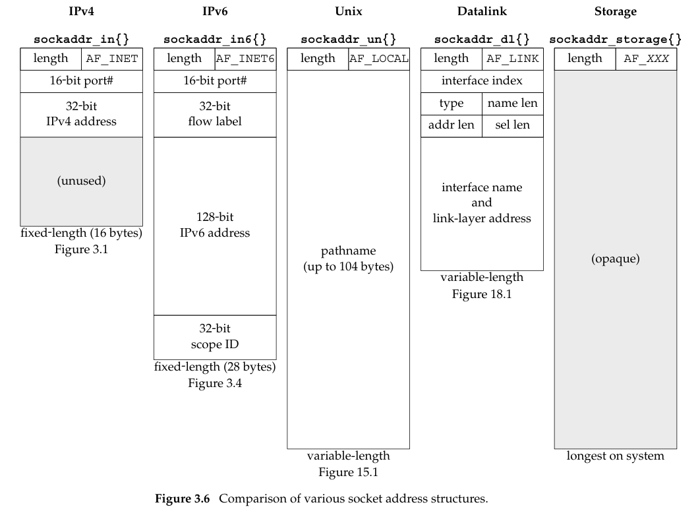
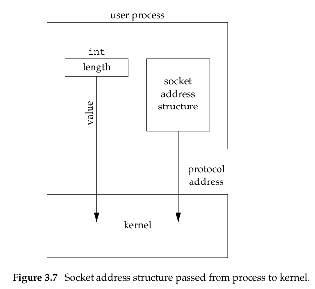
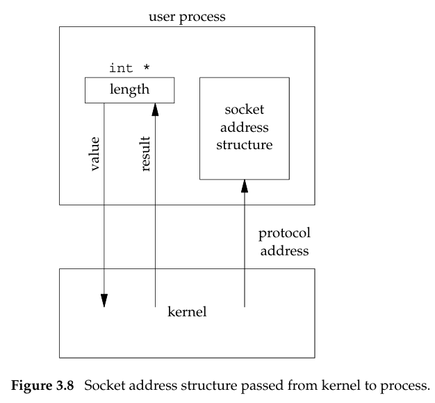
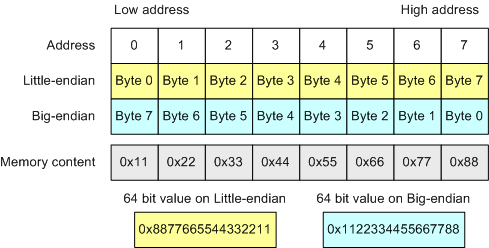
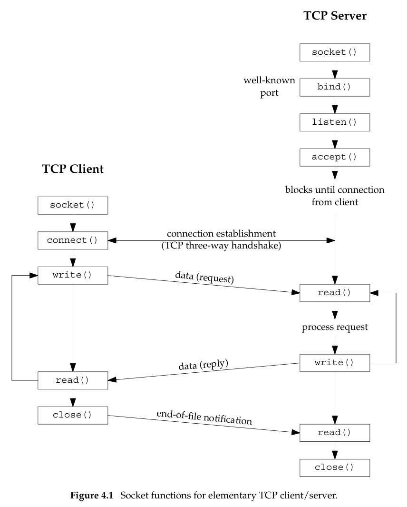

# Section 7

- **Section**: Linux System Programming
- **Topic**: Socket Programming - TCP/UDP Sockets & I/O Multiplexing (select/poll/epoll)  
- **Purpose**: Understand the socket API, build TCP/UDP-based servers/clients, and extend to non-blocking I/O multiplexing for handling many simultaneous connections. Raw sockets are out of scope for this reduced program.
- **Expectation**: Working concurrent TCP echo server/client + UDP echo, rebuilt using select/poll/epoll, plus a threaded multiplexing variant. 

---

## 1. OSI model



|Layer|Name|Role|Examples|
|-|-|-|-|
|7|Application|	User-facing protocols|HTTP, FTP, MQTT, CoAP|
|6|Presentation|Data formatting, encryption, compression|TLS, JPEG, ASCII/EBCDIC|
|5|Session|Session establishment/teardown, checkpointing|	RPC, sockets session mgmt|
|4|Transport|End-to-end delivery, reliability, flow control|TCP, UDP|
|3|Network|	Logical addressing, routing|IP, ICMP|
|2|Data Link|Framing, MAC addressing, error detection on a link|Ethernet, Wi-Fi (802.11), PPP|
|1|Physical|Bits on the wire/air|Voltages, radio, fiber optics|

## 2. BSD Networking History




- 1969 — Unix originates at AT&T Bell Labs (Ken Thompson, Dennis Ritchie).
- 1971 — First edition of Unix released internally.
- 1970s — Unix source distributed to universities, including UC Berkeley.
- 1977 — First Berkeley Software Distribution (1BSD), built on top of AT&T Unix.
- 1983 — The sockets API originated with 4.2BSD. 
- 1989 — Berkeley released the first BSD networking release, containing networking code not constrained by the AT&T Unix source license, and eventually distributed via anonymous FTP. 
- 1990 — 4.3BSD Reno brought OSI protocol changes to the sockets API. 
- 1994 — 4.4BSD-Lite released — the last Berkeley release requiring an AT&T Unix source license. 
- 1995 — 4.4BSD-Lite2 released. 
- Post-1995 → today — These final releases became the base for BSD/OS, FreeBSD, NetBSD, and OpenBSD, most of which are still actively developed

## 3. Socket

### 3.1. What is a Socket?

A socket is one endpoint of a two way communication link between two programs running on the network.



### 3.2. How Sockets Work in Computer Networks

Sockets is created using `socket` system call. The socket provides bidirectional FIFO Communication facility over the network.

- A socket connecting to the network is created at each end of the communication.
- Each socket has a specific address.
- This address is composed of an IP address and a port number.
- Socket are generally employed in client server applications.
- The server creates a socket, attaches it to a network port addresses then waits for the client to contact it.
- The client creates a socket and then attempts to connect to the server socket.
- When the connection is established, transfer of data takes place.



### 3.3. Two Types of Sockets

**Stream Sockets** `SOCK_STREAM`

**Datagram Sockets** `SOCK_DGRAM`

### 3.4. Socket Address Structures

Socket address structures are passed between user processes and the kernel to specify network endpoints (IP addresses and port numbers). Each protocol suite defines its own structure.



**IPv4 Socket Address Structure (`struct sockaddr_in`)**:

Defined in `<netinet/in.h>`

```c

struct in_addr {
    in_addr_t      s_addr;      /* 32-bit IPv4 address */
                                /* network byte ordered */
};
struct sockaddr_in {
    uint8_t        sin_len;     /* length of structure (16) */
    sa_family_t    sin_family;  /* AF_INET */
    in_port_t      sin_port;    /* 16-bit TCP or UDP port number */
                                /* network byte ordered */
    struct in_addr sin_addr;    /* 32-bit IPv4 address */
                                /* network byte ordered */
    char           sin_zero[8]; /* unused */
};
```

**IPv6 Socket Address Structure (`struct sockaddr_in6`)**

Defined in `<netinet/in.h>`

```c
struct in6_addr {
    uint8_t         s6_addr[16];    /* 128-bit IPv6 address */
                                    /* network byte ordered */
};
#define SIN6_LEN        /* required for compile-time tests */

struct sockaddr_in6 {
    uint8_t         sin6_len;       /* length of this struct (28) */
    sa_family_t     sin6_family;    /* AF_INET6 */
    in_port_t       sin6_port;      /* transport layer port# */
                                    /* network byte ordered */
    uint32_t        sin6_flowinfo;  /* flow information, undefined */
    struct in6_addr sin6_addr;      /* IPv6 address */
                                    /* network byte ordered */
    uint32_t        sin6_scope_id;  /* set of interfaces for a scope */
};
```

**Generic Socket Address Structure (`struct sockaddr`)**:

Defined in `<netinet/in.h>`

```c
struct sockaddr {
    uint8_t     sa_len;
    sa_family_t sa_family;   /* address family: AF_xxx value */
    char        sa_data[14]; /* protocol-specific address */
};
```

**New Generic Socket Address Structure (`struct sockaddr_storage`)**:

Defined in `<netinet/in.h>`

```c
struct sockaddr_storage {
uint8_t     ss_len;     /* length of this struct (implementation dependent) */
sa_family_t ss_family;  /* address family: AF_xxx value */
/* implementation-dependent elements to provide:
 * a) alignment sufficient to fulfill the alignment requirements of
 *    all socket address types that the system supports.
 * b) enough storage to hold any type of socket address that the
 *    system supports.
 */
};
```

### 3.5. Value-Result Arguments

When a socket address structure is passed to any socket function, it is always **passed by reference** (a pointer to the structure is passed).

**`bind`, `connect`, `sendto` (Value Only):**

- Pass a socket address structure from the process to the kernel.
- Arguments:
    - A pointer to the socket address structure.
    - An integer size of the struct (pass by value) 
        - The kernel knows how much data to copy. 



**`accept`, `recvfrom`, `getsockname`, `getpeername` (Value-Result):**

- Pass a socket address structure from the kernel to the process.
- Arguments:
    - A pointer to the socker address structure
    - A pointer to an integer size of the struct:  
        - *When functions calls*: process tells kernel to not write past the end of the structure
        - *When functions returns*: kernel tells process how much data that kernel stored in the structure



### 3.6. Byte Ordering

#### 3.6.1. Endianness

**Endianness** refers to the order in which bytes are arranged in memory. Endianness comes in two primary forms:

- **Big-endian**: Stores the most significant byte first

- **Little-endian**: Store the least significant byte first



#### 3.6.2. Why does it matter?

Different CPU architectures store multibyte integers in memory using different byte orderings:

- **Little-Endian**: The low-order byte is stored at the lowest memory address (used by Intel/x86 architectures).
- **Big-Endian**: The high-order byte is stored at the lowest memory address (used by Sparc, Motorola 68k, etc.)

When programming with network, we must deal with these byte ordering differences between Host Byte Order and Network Byte Order:

- **Host Byte Order**: The native byte ordering used by the local host CPU.
- **Network Byte Order**: The standard byte ordering required by Internet protocols for header fields (e.g., IP addresses and port numbers), which is strictly **Big-Endian**

#### 3.6.3. Byte Ordering Functions 

We use the following four functions to convert between Host Byte Order and Network Byte Order.

```c
#include <netinet/in.h>

uint16_t htons(uint16_t host16bitvalue);
uint32_t htonl(uint32_t host32bitvalue);
/* Both return: value in network byte order */

uint16_t ntohs(uint16_t net16bitvalue);
uint32_t ntohl(uint32_t net32bitvalue);
/* Both return: value in host byte order */
```

**Example**:
```c
#include <stdio.h>
#include <stdint.h>
#include <sys/types.h>
#include <netinet/in.h>

int main()
{
    uint32_t host_value = 1234567890;
    uint32_t network_value = htonl(host_value);

    printf("Value:\t%u\n", host_value);
    printf("Host representation:\t%x\n", host_value);
    printf("Network representation:\t%x\n", network_value);
    printf("Host prints network value: %u\n", network_value);

    return 0;
}
```
Output:
```
Value:  1234567890
Host representation:    499602d2
Network representation: d2029649
Host prints network value: 3523384905
```

#### 3.6.4. inet_aton, inet_addr, inet_ntoa Functions

These functions convert an IPv4 address from a dotted-decimal string to its 32-bit network byte ordered binary value. (e.g. `"192.168.1.1"` to `0101a8c0`)

```c
#include <arpa/inet.h>

int inet_aton(const char *strptr, struct in_addr *addrptr);
/* Returns: 1 if string was valid, 0 on error */

in_addr_t inet_addr(const char *strptr);
/* Returns: 32-bit binary network byte ordered IPv4 address; INADDR_NONE if error */

char *inet_ntoa(struct in_addr inaddr);
/* Returns: pointer to dotted-decimal string */
```

#### 3.6.5. inet_pton, inet_ntop Functions

These two functions are new with IPv6 and work with both IPv4 and IPv6 addresses.

The letters `p` and `n` stand for presentation and numeric.

```c
#include <arpa/inet.h>

int inet_pton(int family, const char *strptr, void *addrptr);
/* Returns: 1 if OK, 0 if input not a valid presentation format, −1 on error */

const char *inet_ntop(int family, const void *addrptr, char *strptr, size_t len);
/* Returns: pointer to result if OK, NULL on error */
```

- `family`: either `AF_INET` (IPv4) or `AF_INET6` (IPv6)

### 4. TCP Sockets

#### 4.1. socket Function

To perform network I/O, the first thing a process must do is call the socket function

 

```c
#include <sys/socket.h>

int socket(int family, int type, int protocol);
/* Returns: non-negative descriptor if OK, −1 on error */
```

Arguments:

|*`family`*| Description|
|-|-|
|`AF_INET`| IPv4 protocols|
|`AF_INET6`| IPv6 protocols|
|`AF_LOCAL`| Unix domain protocols|
|`AF_ROUTE`| Routing sockets|
|`AF_KEY`| Key socket|

|*`type`*| Description|
|-|-|
|`SOCK_STREAM`| stream socket|
|`SOCK_DGRAM`| datagram socket|
|`SOCK_SEQPACKET`| sequenced packet socket|
|`SOCK_RAW`| raw socket|

|*`Protocol`*| Description|
|-|-|
|`IPPROTO_TCP`| TCP transport protocol|
|`IPPROTO_UDP`| UDP transport protocol|
|`IPPROTO_SCTP`| SCTP transport protocol|

Combinations of `family` and `type` for the `socket` function:
||`AF_INET`| `AF_INET6`| `AF_LOCAL`| `AF_ROUTE`| `AF_KEY`|
|-|-|-|-|-|-|
|`SOCK_STREAM`|TCP/SCTP|TCP/SCTP|Yes|||
|`SOCK_DGRAM`|UDP|UDP|Yes|||
|`SOCK_SEQPACKET`|SCTP|SCTP|Yes|||
|`SOCK_RAW`|IPv4|IPv6||Yes|Yes|

#### 4.2. connect Function

The `connect` function is used by a *TCP client* to *establish a connection* with a *TCP server*.

```c
#include <sys/socket.h>

int connect(int sockfd, const struct sockaddr *servaddr, socklen_t addrlen);

/* Returns: 0 if OK, −1 on error */
```

- `sockfd`: a socket descriptor returned by the `socket` function

#### 4.3. bind Function

The `bind` function assigns a local protocol address to a socket.

```c
#include <sys/socket.h>

int bind(int sockfd, const struct sockaddr *myaddr, socklen_t addrlen);

/* Returns: 0 if OK, −1 on error */
```

#### 4.4. listen Function

The `listen` function is called only by a TCP server and it performs two actions:

```c
#include <sys/socket.h>

int listen(int sockfd, int backlog);

/* Returns: 0 if OK, −1 on error */
```

- `backlog`: the maximum number of connections the kernel should queue for this socket.

#### 4.5. accept Function

```c
#include <sys/socket.h>

int accept(int sockfd, struct sockaddr *cliaddr, socklen_t *addrlen);

/* Returns: 0 if OK, −1 on error */
```

### Lab 

#### Lab 1
Write a concurrent TCP echo server (fork-per-connection) plus a client 

#### Lab 2
Test failure scenarios: server crash, client crash, and correct handling of SIGPIPE 

#### Lab 3
Write a UDP echo server/client 

#### Lab 4
Build a chat-room server first using select(), then rebuild it using poll(), and compare the code 

#### Lab 5
Rebuild the chat-room server once more using epoll (edge-triggered, non-blocking sockets) 

#### Lab 6
Combine multiplexing with a small thread pool (threads + poll/epoll) to handle many simultaneous connections